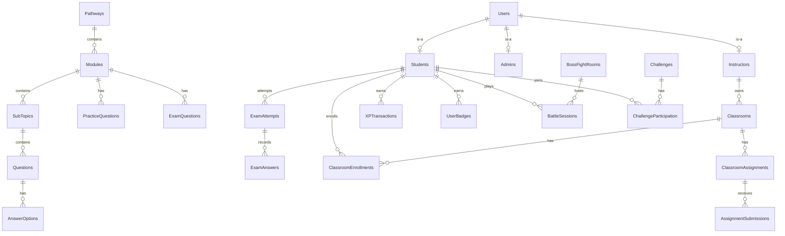

# CloudPhoria — Assignment Report Draft

> CT050-3-2-WAPP — Web Applications, Group Assignment
> This file is a **drafting aid only**. It is not referenced by the project (`.csproj`, code, or database) and can be deleted at any time without affecting the running application. Copy the sections you need into your actual Word/PDF report, add screenshots/diagrams, and adjust wording to match your own voice before submission — do not submit this file as-is.

---

## How to use this file

Each section below maps directly to a bullet point from your assignment brief (Recommended Content: Table of Contents, Introduction/Project Plan, Requirement Specification, Design and Modeling, Implementation). Where a diagram or screenshot is genuinely required (ERD image, wireframes, page screenshots), this file gives you the *content* to put in the diagram plus a ready-to-render Mermaid version where possible — you still need to paste actual screenshots from the running app into your Word doc, since this file can't capture live UI screenshots for you.

---

## 1. Table of Contents (template)

Build your real ToC in Word using "Insert Table of Contents" against your Heading styles so page numbers stay accurate automatically. Suggested top-level structure matching the assignment brief:

1. Introduction / Project Plan .......................... (page)
   1.1 Objectives
   1.2 Scope
   1.3 Project Schedule
2. Requirement Specification ........................... (page)
   2.1 Audience Modeling
   2.2 Use Cases
   2.3 Flow Charts
   2.4 Major Functions
3. Design and Modeling ................................. (page)
   3.1 Entity Relationship Diagram (ERD)
   3.2 Wireframes
   3.3 Website Navigational Structure
4. Implementation ....................................... (page)
   4.1 CSS / Styling
   4.2 Form Validation
   4.3 SQL Queries and Database Connectivity
5. Conclusion / References (if required by your brief)

---

## 2. Introduction / Project Plan

### 2.1 Objectives

Draft wording (edit to your own voice):

> CloudPhoria is a gamified web-based cloud-computing learning platform built with ASP.NET Web Forms and SQL Server. The objective of the project is to design and implement a full-featured e-learning system that supports three distinct user roles — Student, Instructor, and Admin — each with role-specific dashboards and permissions, while combining structured learning content with gamification elements (XP, badges, certifications, timed challenges, and boss-fight style quizzes) to increase learner engagement.

Specific objectives you can list:

- To design a relational database that models learning pathways, modules, subtopics, and assessments (practice quizzes, timed exams).
- To implement secure, role-based authentication and authorisation for Student, Instructor, and Admin accounts.
- To build an interactive quiz-taking experience with server-side validation, timed countdowns, and XP-based rewards.
- To provide instructors with tools to manage classrooms, assignments, and learning materials for their assigned content.
- To provide administrators with tools to manage users, moderate content, review instructor applications, and monitor system activity via audit logs.
- To apply consistent UI/UX design and accessible, responsive layouts across all pages.

### 2.2 Scope

**In scope:**
- Student, Instructor, and Admin role-based portals (see Section 3.3 for the full page list).
- Learning content hierarchy: Pathways → Modules → SubTopics → interactive Questions.
- Assessment system: practice quizzes (unlimited attempts) and timed module exams (one active attempt, pass/fail with XP reward).
- Gamification: XP transactions, badges, certifications, time-boxed Challenges, and Boss Fight battle rooms.
- Classroom management: instructor-led classrooms, enrollments, materials, and assignments with student submissions.
- Moderation and admin tooling: user management, instructor approval workflow, content reports, audit logging, notifications.
- Subscription/pricing tiers (Free / Pro / Student plans) gating access to premium content.

**Out of scope / explicitly removed features** (mention these if your brief expects you to justify scope boundaries):
- Consultation booking (Instructor/Student appointment scheduling) — built, then explicitly removed by team decision; database tables remain unused for schema completeness only.
- Admin-side moderation UI for community Fun Rooms — Fun Rooms remain a student-facing feature, but a separate admin review page for them was removed to avoid duplicating existing content-moderation tooling.

### 2.3 Project Schedule (template — fill in your actual dates/sprints)

| Phase | Activities | Approx. Duration |
|---|---|---|
| Planning | Requirement gathering, ERD design, page/site-map planning | Week 1 |
| Database Implementation | Table creation, seed scripts, relationships/constraints | Week 2 |
| Core Auth & Layout | Login/Register, role-based Master Page navigation | Week 2–3 |
| Learning Content Module | Pathways, Modules, SubTopics, interactive questions | Week 3–4 |
| Assessment Module | Practice quizzes, timed exams, scoring, XP integration | Week 4–5 |
| Gamification Module | Challenges, Boss Fights, badges, certifications | Week 5–6 |
| Classroom Module | Classrooms, enrollments, materials, assignments | Week 6–7 |
| Admin Module | User management, approvals, reports, audit logs | Week 7 |
| Testing & Bug Fixing | Cross-role testing, duplicate-data fixes, merge conflict resolution | Week 8 |
| Documentation & Submission | Report writing, screenshots, final review | Week 8–9 |

Adjust the durations/weeks to match your actual semester timeline and add real dates.

---

## 3. Requirement Specification

### 3.1 Audience Modeling

Three primary user personas, matching the three system roles:

**1. Student**
- Goal: learn cloud-computing concepts, track progress, earn rewards, engage with classmates.
- Needs: browse pathways, take quizzes/exams, view XP/badges, join classrooms, compete in challenges/boss fights.

**2. Instructor**
- Goal: teach assigned content and manage a classroom of students.
- Needs: view assigned modules/subtopics/questions (read-only — content authoring is Admin-only, see note below), manage classrooms, upload materials, set assignments, grade submissions, create challenges.

**3. Admin**
- Goal: govern the platform — manage accounts, own all learning content, moderate reports, and audit system activity.
- Needs: full CRUD on Pathways/Modules/SubTopics/Questions, approve/reject instructor applications, manage users, view reports and audit logs, view analytics/reports dashboard.

> Design note for your report: originally both Instructors and Admins could create/edit Modules/SubTopics/Questions. The team later restricted authoring of core learning content to Admin only, with Modules optionally *assigned* to an Instructor for teaching purposes — Instructors keep full ownership of their own Classrooms, Materials, Assignments, and Challenges. This mirrors a real LMS curriculum-control model, where a central academic body owns course content and individual instructors are assigned to teach/deliver it. You can present this as a deliberate requirement-refinement decision in your report.

### 3.2 Use Cases (textual — convert to UML use-case diagrams in draw.io / Lucidchart)

**Student use cases:** Register/Login, Browse Pathways, View Module, Complete SubTopic, Answer Practice Questions, Take Module Exam, Join Classroom (via invite code), Submit Assignment, Join Challenge, Take Challenge Quiz, Battle in Boss Fight Room, View Badges/Certifications, View Leaderboard, Upgrade Subscription, View Notifications.

**Instructor use cases:** Login, View Assigned Modules (read-only), Manage Classroom, Enroll/Remove Students, Upload Classroom Material, Create Assignment, Grade Submission, Create Challenge, Add Challenge Questions, View Own Profile.

**Admin use cases:** Login, Manage Users (activate/ban), Approve/Reject Instructor Application, Create/Edit/Delete Pathway, Create/Edit/Delete Module, Assign Instructor to Module, Create/Edit/Delete SubTopic, Create/Edit/Delete Question, Create Boss Fight Room, Create Challenge, Review Reports, View Audit Logs, View System Reports/Analytics.

**Shared use cases:** Login, Logout, View Profile, Edit Profile, Receive Notification.

### 3.3 Flow Charts (describe the logic — draw as an actual flowchart in draw.io)

**Example: Module Exam flow (a good one to diagram, since it has clear branching):**

```
Start
  -> Student opens Exams.aspx
  -> System checks: has student already passed this module's exam?
       Yes -> Show "Already Passed" state, End
       No  -> System checks: does module have exam questions?
                No  -> Show "Not Available", End
                Yes -> Show intro screen ("Start Exam" button)
  -> Student clicks Start Exam
  -> System creates ExamAttempts row (StartedAt = now)
  -> Loop: show one question at a time with shuffled options + live countdown
       -> Student selects an answer -> System validates server-side, saves to ExamAnswers
       -> Time runs out on a question -> auto-advance / auto-submit
  -> On last question or timeout -> System computes ScorePercent
  -> System compares ScorePercent to Module.ExamPassMarkPercent
       Pass (first time) -> Award XP via XPTransactions, update Students.TotalXP
       Pass (already passed before) -> No duplicate XP
       Fail -> No XP, allow retry (new attempt)
  -> Show result screen
End
```

Other flows worth diagramming the same way: Login/Role-based redirect, Instructor Approval workflow, Boss Fight battle turn loop, Challenge quiz-taking flow.

### 3.4 Major Functions (summary table for your report)

| Function Area | Key Pages | Key Tables |
|---|---|---|
| Authentication & Roles | `LogIn.aspx`, `Register.aspx` | `Users`, `Students`, `Instructors`, `Admins` |
| Learning Content | `Admin/Courses.aspx`, `Student/Pathways.aspx`, `ModuleDetail.aspx`, `SubTopicView.aspx` | `Pathways`, `Modules`, `SubTopics`, `Questions`, `AnswerOptions` |
| Practice & Exams | `Student/Exams.aspx`, `ModuleDetail.aspx` | `PracticeQuestions`, `PracticeAttempts`, `ExamQuestions`, `ExamAttempts`, `ExamAnswers` |
| Gamification | `Student/Challenges.aspx`, `Student/BossFights.aspx`, `Student/Achievements.aspx` | `Challenges`, `ChallengeParticipation`, `BossFightRooms`, `Bosses`, `BattleSessions`, `Badges`, `XPTransactions` |
| Classrooms | `Instructor/Classrooms.aspx`, `Student/Classrooms.aspx`, `Student/ClassroomDetail.aspx` | `Classrooms`, `ClassroomEnrollments`, `ClassroomMaterials`, `ClassroomAssignments`, `AssignmentSubmissions` |
| Admin & Moderation | `Admin/Users.aspx`, `Admin/InstructorApprovals.aspx`, `Admin/Reports.aspx`, `Admin/AuditLogs.aspx` | `Users`, `Instructors`, `Reports`, `AuditLogs`, `Notifications` |
| Subscriptions | `Student/Upgrade.aspx` | `SubscriptionPlans`, `UserSubscriptions` |

---

## 4. Design and Modeling

### 4.1 Entity Relationship Diagram (ERD)

Full authoritative table list (52 tables) and every foreign key is documented in `CloudPhoria_DataSchema.md` (Section 5 "Table Summary" and Section 9 "Main Foreign Key Relationships") — pull the full list from there so your report matches the real database exactly.

For your report, a full 52-table ERD is usually too dense to read on one page. Recommended approach: draw **one overview ERD** grouping tables by feature area (Users/Roles, Learning Content, Assessments, Gamification, Classrooms, Moderation), then optionally 1-2 **detailed sub-ERDs** for the most complex areas (e.g. Learning Content + Assessments).

Below is a condensed core-ERD in Mermaid syntax covering the central hierarchy — paste this into a Mermaid live editor (https://mermaid.live) or a VS Code Mermaid preview extension to render an actual diagram image you can screenshot into your report:



Note in your report text: "`Users` is the base authentication table; `Students`, `Instructors`, and `Admins` each share the same primary key as `Users.UserID` (a shared-PK / table-per-role inheritance pattern), not a separate identity column."

### 4.2 Wireframes

Since wireframes need to reflect the actual rendered pages, the fastest accurate approach is: open each key page in the browser, and either (a) sketch a simplified box-layout wireframe by hand/Figma based on what you see, or (b) take a real screenshot and label it as a "high-fidelity wireframe" if your brief allows that. Below is the layout structure of the shared Master Page (`Site.Master`) that every page inherits, described as a wireframe outline you can redraw:

```
+--------------------------------------------------------------+
| TOP NAV BAR (dark, sticky)                                    |
|  [Logo] [Role-based nav links...]      [XP badge] [Bell] [Avatar] |
+--------------------------------------------------------------+
|                                                                |
|                     MAIN CONTENT AREA                         |
|              (light background, page-specific content         |
|               rendered inside ContentPlaceHolder "MainContent")|
|                                                                |
+--------------------------------------------------------------+
| FOOTER (dark)                                                 |
|  [Logo] CloudPhoria © year        [Role-based footer links]   |
+--------------------------------------------------------------+
```

Role-based nav link sets (draw one wireframe variant per role, or one wireframe + a table of which links show per role):

| Role | Top Nav Links |
|---|---|
| Guest (not logged in) | Browse Pathways, Boss Fights, Challenges, Pricing, Log In, Join for Free |
| Student | Dashboard, Learn ▾ (Pathways/My Learning/Exams), Compete ▾ (Challenges/Boss Fights), Classrooms, Go Pro |
| Instructor | Dashboard, Modules, Subtopics, Questions, Classrooms, Materials, Assignments, Challenges |
| Admin | Dashboard, Users, Approvals, Courses, Challenges, Reports, Audit Logs |

Recommend wireframing at minimum: Login page, Student Dashboard, Module/SubTopic view (question-answering UI), Exam-taking screen (with countdown), Admin Courses page (module/subtopic/question management), and Instructor Classroom detail page — these are the pages with the most unique layout/interaction patterns.

### 4.3 Website Navigational Structure

Site map by role (derived directly from `Site.Master`'s navigation panels and the `.csproj` page list):

```
CloudPhoria
├── Public / Guest
│   ├── Default.aspx (landing page)
│   ├── LogIn.aspx
│   ├── Register.aspx
│   ├── Student/Pathways.aspx        (guest can browse)
│   ├── Student/BossFights.aspx      (guest can preview)
│   ├── Student/Challenges.aspx      (guest can preview)
│   └── Student/Upgrade.aspx         (pricing)
│
├── Student
│   ├── Dashboard.aspx
│   ├── Pathways.aspx -> PathwayDetail.aspx -> ModuleDetail.aspx -> SubTopicView.aspx
│   ├── MyLearning.aspx
│   ├── Exams.aspx
│   ├── Challenges.aspx
│   ├── BossFights.aspx
│   ├── Classrooms.aspx -> ClassroomDetail.aspx -> AssignmentDetail.aspx
│   ├── Achievements.aspx
│   ├── Notifications.aspx
│   └── Profile.aspx
│
├── Instructor
│   ├── Dashboard.aspx
│   ├── Modules.aspx (read-only)
│   ├── SubTopics.aspx (read-only)
│   ├── Questions.aspx (read-only)
│   ├── Classrooms.aspx (own classrooms, materials upload)
│   ├── Materials.aspx
│   ├── Assignments.aspx
│   ├── Challenges.aspx (create/manage own challenges)
│   ├── Notifications.aspx
│   └── Profile.aspx
│
└── Admin
    ├── Dashboard.aspx
    ├── Users.aspx
    ├── InstructorApprovals.aspx
    ├── Courses.aspx (full CRUD: Pathways/Modules/SubTopics/Questions)
    ├── Challenges.aspx
    ├── Reports.aspx
    ├── AuditLogs.aspx
    ├── Notifications.aspx
    └── Profile.aspx
```

Redraw this as a tree/site-map diagram (draw.io has a "tree" shape library) for your report.

---

## 5. Implementation

Use this section as a guide for what to write about, then pull real short code snippets from your actual files to illustrate each point (your marker will want to see real code, not just a description).

### 5.1 CSS / Page Styling

- CloudPhoria uses **Bootstrap 5** (`Content/bootstrap.css`) as the base grid/utility framework, layered with a custom design system in `Content/Site.css` and page-scoped `<style>` blocks (see `Site.Master` for an example — the top navigation bar, dropdown menus, XP badge, and footer are all custom CSS, not default Bootstrap components).
- Design tokens used consistently: dark navy (`#1A2332`) for nav/footer, sky blue (`#0EA5E9`) and indigo (`#6366F1`) as brand gradient accents, amber (`#F59E0B`) for XP/gamification highlights.
- Responsive behaviour: a `@media(max-width:768px)` breakpoint collapses the top nav into a toggleable mobile menu (see the `.cp-topnav-toggle` button and `cp-topnav-links.show` class in `Site.Master`).
- For your report: pick 1-2 CSS blocks (e.g. the `.cp-topnav-dropdown` styling) and explain what each rule does — this demonstrates you understand your own styling rather than just describing "we used CSS."

### 5.2 Form Validation

Describe your actual validation approach with real examples from your `.cs` files. Two layers are used throughout the project:

- **Client-side:** ASP.NET `RequiredFieldValidator`/`RegularExpressionValidator`/`CompareValidator` controls on forms (e.g. Register.aspx password confirmation, Login.aspx required fields) — gives immediate feedback before postback.
- **Server-side:** every form handler re-validates in code-behind before touching the database (never trusts client-side validation alone), e.g.:
  - Checking `Session["UserID"]`/`Session["Role"]` at the top of every protected page's `Page_Load` and redirecting to `LogIn.aspx` if missing.
  - Checking ownership before update/delete (e.g. an Instructor can only edit their own Classroom, verified against `Classrooms.InstructorID` server-side, not just hidden in the UI).
  - Re-checking business rules server-side that a malicious user could otherwise bypass by editing form data (e.g. exam countdown time is recomputed from `ExamAttempts.StartedAt` + `Modules.ExamDurationMinutes` on every request — never trusted from a client-submitted value).

Pull 1-2 real code snippets showing a `RequiredFieldValidator` and a server-side ownership check, and explain both in your report.

### 5.3 SQL Queries and Database Connectivity

- Connectivity: ADO.NET with `Microsoft.Data.SqlClient`, connection string read from `connectionStrings.config` via `ConfigurationManager.ConnectionStrings["CloudPhoria"].ConnectionString`.
- Pattern used consistently across the project: `using (SqlConnection conn = new SqlConnection(ConnStr)) { conn.Open(); using (SqlCommand cmd = new SqlCommand(sql, conn)) { ... } }` — `using` blocks guarantee connections/commands are disposed even on exception.
- **All queries use parameterised commands** (`cmd.Parameters.Add(...)`), never string-concatenated SQL, to prevent SQL injection — this is a good security point to call out explicitly in your report.
- Multi-step operations that must succeed or fail together (e.g. inserting an exam answer + updating the attempt's score + awarding XP) use an explicit `SqlTransaction` so partial writes can't corrupt data on error.
- Reads that populate grids/repeaters typically use `SqlDataAdapter` + `DataTable`; single-value/lookup reads use `ExecuteScalar`; existence checks use `SELECT COUNT(*)` patterns.

For your report, pick one meaningful query (e.g. the exam-scoring transaction, or the Boss Fight duplicate-room-prevention `IF NOT EXISTS` guard from `Database/add_more_bossfights.sql`) and walk through it line by line — this is usually worth more marks than listing every query in the project.

---

## 6. Where to find the source-of-truth documentation

For anything not covered above, or if numbers/details drift as the project evolves, always check these two files first — they are kept up to date as the actual project state (not just this drafting aid):

- `CloudPhoria_ProjectRules.md` — feature rules, page structure, business logic decisions, and the reasoning behind design changes (e.g. why content authoring became Admin-only).
- `CloudPhoria_DataSchema.md` — full 52-table schema, every column, every foreign key, seed data notes.
