```mermaid
erDiagram
    %% ===== Core Identity =====
    Users ||--o| Students : "is-a"
    Users ||--o| Instructors : "is-a"
    Users ||--o| Admins : "is-a"

    %% ===== Subscriptions =====
    Students ||--o{ UserSubscriptions : holds
    SubscriptionPlans ||--o{ UserSubscriptions : "plan for"

    %% ===== Learning Content =====
    Pathways ||--o{ Modules : contains
    Modules ||--o{ SubTopics : contains
    Instructors ||--o{ Modules : "created by (optional)"
    SubTopics ||--o{ LearningMaterials : has
    SubTopics ||--o{ Questions : has
    Questions ||--o{ AnswerOptions : has

    %% ===== Exams =====
    Modules ||--o{ ExamQuestions : has
    ExamQuestions ||--o{ ExamQuestionOptions : has
    Students ||--o{ ExamAttempts : attempts
    ExamAttempts ||--o{ ExamAnswers : records
    ExamQuestions ||--o{ ExamAnswers : "answered via"

    %% ===== Progress Tracking =====
    Students ||--o{ SubTopicProgress : tracks
    SubTopics ||--o{ SubTopicProgress : "progress on"
    Students ||--o{ ModuleProgress : tracks
    Modules ||--o{ ModuleProgress : "progress on"

    %% ===== Gamification: Badges / Certs / XP =====
    Modules ||--o{ Badges : awards
    Students ||--o{ UserBadges : earns
    Badges ||--o{ UserBadges : "earned as"
    Pathways ||--o{ Certifications : offers
    Students ||--o{ UserCertifications : earns
    Certifications ||--o{ UserCertifications : "earned as"
    Students ||--o{ XPTransactions : earns

    %% ===== Gamification: Challenges =====
    Instructors ||--o{ Challenges : creates
    Admins ||--o{ Challenges : creates
    Challenges ||--o{ ChallengeQuestions : has
    ChallengeQuestions ||--o{ ChallengeQuestionOptions : has
    Challenges ||--o{ ChallengeParticipation : has
    Students ||--o{ ChallengeParticipation : joins

    %% ===== Boss Fights =====
    Admins ||--o{ BossFightRooms : creates
    BossFightRooms ||--|| Bosses : has
    BossFightRooms ||--o{ BossFightQuestions : has
    BossFightQuestions ||--o{ BossFightQuestionOptions : has
    BossFightRooms ||--o{ BattleSessions : hosts
    Students ||--o{ BattleSessions : plays
    BattleSessions ||--o{ BattleSessionAnswers : logs
    BossFightQuestions ||--o{ BattleSessionAnswers : "answered via"

    %% ===== Classrooms =====
    Instructors ||--o{ Classrooms : owns
    Classrooms ||--o{ ClassroomEnrollments : has
    Students ||--o{ ClassroomEnrollments : enrolls
    Classrooms ||--o{ ClassroomMaterials : has
    Classrooms ||--o{ ClassroomMessages : has
    Users ||--o{ ClassroomMessages : sends
    Classrooms ||--o{ ClassroomAssignments : has
    ClassroomAssignments ||--o{ AssignmentQuestions : has
    AssignmentQuestions ||--o{ AssignmentQuestionOptions : has
    ClassroomAssignments ||--o{ AssignmentSubmissions : receives
    Students ||--o{ AssignmentSubmissions : submits
    AssignmentSubmissions ||--o| Feedback : "graded via"

    %% ===== Moderation & Admin =====
    Users ||--o{ Reports : files
    Users ||--o{ Notifications : receives
    Users ||--o{ AuditLogs : "performed by"
```

# CloudPhoria — ERD: Used vs Unused Tables (with Row Counts)

> Drafting aid only — not referenced by the project, safe to delete anytime, does not affect the build. Verified by querying the actual live database (`sys.tables`/`sys.partitions` on `LAPTOP-D6D50SET\CloudPhoria`) for the real table list and row counts, then cross-checking each table name against every `.cs` file in the repo.
>
> **Correction note:** an earlier draft of this file was based on `CloudPhoria_DataSchema.md`'s documented "52 tables" list, which is actually out of date — the real database has **57 tables**. Five tables exist in the live database but were missing from the doc: `ChallengeQuestions`, `ChallengeQuestionOptions`, `ClassroomMessages`, `FunRoomQuestions`, `FunRoomQuestionOptions`. This file now reflects the real database, not the stale doc.

**Result: 46 of 57 tables are actually used in code. 11 are unused/dead.**

---

## 1. Full table list with row counts and usage status

Row counts pulled live via `SELECT SUM(p.rows) FROM sys.partitions ...` (read-only, does not modify your data).

| # | Table | Rows | Used in code? |
|---:|---|---:|---|
| 1 | `Users` | 13 | ✅ Used |
| 2 | `Students` | 8 | ✅ Used |
| 3 | `Instructors` | 4 | ✅ Used |
| 4 | `Admins` | 1 | ✅ Used |
| 5 | `SubscriptionPlans` | 9 | ✅ Used |
| 6 | `UserSubscriptions` | 24 | ✅ Used |
| 7 | `Classrooms` | 3 | ✅ Used |
| 8 | `ClassroomEnrollments` | 8 | ✅ Used |
| 9 | `ClassroomMaterials` | 12 | ✅ Used |
| 10 | `ClassroomMessages` | 1 | ✅ Used (classroom chat — missing from old doc) |
| 11 | `ClassroomAssignments` | 12 | ✅ Used |
| 12 | `AssignmentQuestions` | 27 | ✅ Used |
| 13 | `AssignmentQuestionOptions` | 60 | ✅ Used |
| 14 | `AssignmentSubmissions` | 8 | ✅ Used |
| 15 | `Pathways` | 7 | ✅ Used |
| 16 | `Modules` | 28 | ✅ Used |
| 17 | `SubTopics` | 140 | ✅ Used |
| 18 | `LearningMaterials` | 0 | ✅ Used (empty — no instructor has uploaded material yet) |
| 19 | `Questions` | 280 | ✅ Used |
| 20 | `AnswerOptions` | 1120 | ✅ Used |
| 21 | `PracticeQuestions` | 280 | ⚠️ Borderline — 1 stray `UPDATE` only, nothing reads/writes real practice attempts |
| 22 | `PracticeQuestionOptions` | 1120 | ❌ Unused |
| 23 | `PracticeAttempts` | 0 | ❌ Unused |
| 24 | `PracticeAnswers` | 0 | ❌ Unused |
| 25 | `ExamQuestions` | 280 | ✅ Used |
| 26 | `ExamQuestionOptions` | 1120 | ✅ Used |
| 27 | `ExamAttempts` | 0 | ✅ Used (0 rows = no student has taken an exam yet, not a code issue) |
| 28 | `ExamAnswers` | 0 | ✅ Used (same as above) |
| 29 | `SubTopicProgress` | 3 | ✅ Used |
| 30 | `ModuleProgress` | 1 | ✅ Used |
| 31 | `Badges` | 28 | ✅ Used |
| 32 | `UserBadges` | 0 | ✅ Used (0 rows = no student has earned one yet) |
| 33 | `Certifications` | 6 | ✅ Used |
| 34 | `UserCertifications` | 0 | ✅ Used (0 rows = no student has earned one yet) |
| 35 | `XPTransactions` | 3 | ✅ Used |
| 36 | `GuestModuleAccess` | 0 | ❌ Unused |
| 37 | `Challenges` | 3 | ✅ Used |
| 38 | `ChallengeQuestions` | 24 | ✅ Used (missing from old doc) |
| 39 | `ChallengeQuestionOptions` | 96 | ✅ Used (missing from old doc) |
| 40 | `ChallengeParticipation` | 1 | ✅ Used |
| 41 | `FunRooms` | 5 | ❌ Unused |
| 42 | `FunRoomQuestions` | 25 | ❌ Unused (missing from old doc) |
| 43 | `FunRoomQuestionOptions` | 100 | ❌ Unused (missing from old doc) |
| 44 | `DiscussionThreads` | 0 | ❌ Unused |
| 45 | `DiscussionReplies` | 0 | ❌ Unused |
| 46 | `ConsultationSlots` | 15 | ❌ Unused |
| 47 | `ConsultationBookings` | 6 | ❌ Unused |
| 48 | `Feedback` | 21 | ✅ Used |
| 49 | `Reports` | 9 | ✅ Used |
| 50 | `AuditLogs` | 19 | ✅ Used |
| 51 | `Notifications` | 19 | ✅ Used |
| 52 | `BossFightRooms` | 8 | ✅ Used |
| 53 | `Bosses` | 8 | ✅ Used |
| 54 | `BossFightQuestions` | 56 | ✅ Used |
| 55 | `BossFightQuestionOptions` | 224 | ✅ Used |
| 56 | `BattleSessions` | 9 | ✅ Used |
| 57 | `BattleSessionAnswers` | 22 | ✅ Used |

---

## 2. UNUSED tables — leave off your ERD, or box separately as "not implemented"

| Table | Rows | Feature |
|---|---:|---|
| `PracticeQuestionOptions` | 1120 | Practice quiz system (seeded but never taken) |
| `PracticeAttempts` | 0 | Practice quiz system |
| `PracticeAnswers` | 0 | Practice quiz system |
| `GuestModuleAccess` | 0 | Guest tracking (handled via session checks instead) |
| `FunRooms` | 5 | Community rooms (seeded but no page uses it) |
| `FunRoomQuestions` | 25 | Community rooms |
| `FunRoomQuestionOptions` | 100 | Community rooms |
| `DiscussionThreads` | 0 | Forum feature (never implemented) |
| `DiscussionReplies` | 0 | Forum feature |
| `ConsultationSlots` | 15 | Consultation booking (removed feature) |
| `ConsultationBookings` | 6 | Consultation booking (removed feature) |

`PracticeQuestions` (280 rows) is borderline — seeded and technically touched by one `UPDATE` in `Admin/Courses.aspx.cs`, but no page lets a student actually take a practice quiz. Your call whether to count it as used.

Notice several unused tables still have seed data (`PracticeQuestionOptions` 1120 rows, `FunRoomQuestionOptions` 100 rows, `ConsultationSlots` 15 rows) — that's leftover from database seed scripts in `Database/`, not evidence the feature works. Row count alone doesn't prove a table is "used" by the app; always cross-check against actual code.

---

## 3. USED tables — grouped for a readable ERD (46 tables)

### Core Identity (4)
`Users`, `Students`, `Instructors`, `Admins`

### Subscriptions (2)
`SubscriptionPlans`, `UserSubscriptions`

### Learning Content (6)
`Pathways`, `Modules`, `SubTopics`, `LearningMaterials`, `Questions`, `AnswerOptions`

### Exams (4, +1 borderline)
`ExamQuestions`, `ExamQuestionOptions`, `ExamAttempts`, `ExamAnswers` (+ borderline `PracticeQuestions`)

### Progress Tracking (2)
`SubTopicProgress`, `ModuleProgress`

### Gamification — Badges/Certs/XP (5)
`Badges`, `UserBadges`, `Certifications`, `UserCertifications`, `XPTransactions`

### Gamification — Challenges (4)
`Challenges`, `ChallengeQuestions`, `ChallengeQuestionOptions`, `ChallengeParticipation`

### Boss Fights (6)
`BossFightRooms`, `Bosses`, `BossFightQuestions`, `BossFightQuestionOptions`, `BattleSessions`, `BattleSessionAnswers`

### Classrooms (8)
`Classrooms`, `ClassroomEnrollments`, `ClassroomMaterials`, `ClassroomMessages`, `ClassroomAssignments`, `AssignmentQuestions`, `AssignmentQuestionOptions`, `AssignmentSubmissions`

### Moderation & Admin (4)
`Feedback`, `Reports`, `AuditLogs`, `Notifications`

**Total: 4+2+6+4+2+5+4+6+8+4 = 45, plus borderline `PracticeQuestions` = 46.** ✓ matches summary above.

---

## 4. Mermaid ERD — used tables only (46 tables)

Paste into https://mermaid.live to render an image, then screenshot into your report.

---

## 5. If your marker asks "why does your schema have tables you don't use"

Honest, defensible answer for your report/viva: these tables were designed up front during requirement analysis as part of a broader feature set (practice quizzes, discussion forums, instructor consultations, community-authored Fun Rooms, guest access tracking). During implementation, the team prioritised the core learning-and-assessment flow, gamification, and classroom management, and either descoped these features for time (Practice Quizzes, Discussions, Guest tracking, Fun Rooms) or explicitly removed a feature after building and testing it once (Consultation booking). Some of these tables still have seed data from early database scripts, but no page in the application currently reads or writes them. The tables remain in the schema for completeness and possible future extension.

This is a normal, expected outcome in real projects — better to explain it clearly with evidence (as above) than to claim every table is wired up.
