# CloudPhoria — ERD: Used Tables

> Drafting aid only — not referenced by the project, safe to delete anytime, does not affect the build. Verified by querying the actual live database (`sys.tables`/`sys.partitions` on `LAPTOP-D6D50SET\CloudPhoria`) for the real table list and row counts, then cross-checking each table name against every `.cs` file in the repo.
>
> **Note:** The real database has **57 tables**, but **11 are unused/dead** and have been removed from this document. Only the 46 active tables are shown below.

---

## 1. Used tables with row counts (46 tables)

| # | Table | Rows | Notes |
|---:|---|---:|---|
| 1 | `Users` | 13 | |
| 2 | `Students` | 8 | |
| 3 | `Instructors` | 4 | |
| 4 | `Admins` | 1 | |
| 5 | `SubscriptionPlans` | 9 | |
| 6 | `UserSubscriptions` | 24 | |
| 7 | `Classrooms` | 3 | |
| 8 | `ClassroomEnrollments` | 8 | |
| 9 | `ClassroomMaterials` | 12 | |
| 10 | `ClassroomMessages` | 1 | |
| 11 | `ClassroomAssignments` | 12 | |
| 12 | `AssignmentQuestions` | 27 | |
| 13 | `AssignmentQuestionOptions` | 60 | |
| 14 | `AssignmentSubmissions` | 8 | |
| 15 | `Pathways` | 7 | |
| 16 | `Modules` | 28 | |
| 17 | `SubTopics` | 140 | |
| 18 | `LearningMaterials` | 0 | Empty — no instructor has uploaded material yet |
| 19 | `Questions` | 280 | |
| 20 | `AnswerOptions` | 1120 | |
| 21 | `PracticeQuestions` | 280 | Borderline — one stray `UPDATE` in `Admin/Courses.aspx.cs`; no student-facing quiz UI |
| 22 | `ExamQuestions` | 280 | |
| 23 | `ExamQuestionOptions` | 1120 | |
| 24 | `ExamAttempts` | 0 | 0 rows = no student has taken an exam yet |
| 25 | `ExamAnswers` | 0 | 0 rows = no student has taken an exam yet |
| 26 | `SubTopicProgress` | 3 | |
| 27 | `ModuleProgress` | 1 | |
| 28 | `Badges` | 28 | |
| 29 | `UserBadges` | 0 | 0 rows = no student has earned one yet |
| 30 | `Certifications` | 6 | |
| 31 | `UserCertifications` | 0 | 0 rows = no student has earned one yet |
| 32 | `XPTransactions` | 3 | |
| 33 | `Challenges` | 3 | |
| 34 | `ChallengeQuestions` | 24 | |
| 35 | `ChallengeQuestionOptions` | 96 | |
| 36 | `ChallengeParticipation` | 1 | |
| 37 | `Feedback` | 21 | |
| 38 | `Reports` | 9 | |
| 39 | `AuditLogs` | 19 | |
| 40 | `Notifications` | 19 | |
| 41 | `BossFightRooms` | 8 | |
| 42 | `Bosses` | 8 | |
| 43 | `BossFightQuestions` | 56 | |
| 44 | `BossFightQuestionOptions` | 224 | |
| 45 | `BattleSessions` | 9 | |
| 46 | `BattleSessionAnswers` | 22 | |

---

## 2. Tables grouped by feature area

### Core Identity (4)
`Users`, `Students`, `Instructors`, `Admins`

### Subscriptions (2)
`SubscriptionPlans`, `UserSubscriptions`

### Learning Content (6)
`Pathways`, `Modules`, `SubTopics`, `LearningMaterials`, `Questions`, `AnswerOptions`

### Exams (4, +1 borderline)
`ExamQuestions`, `ExamQuestionOptions`, `ExamAttempts`, `ExamAnswers` (+ borderline `PracticeQuestions`)

### Progress Tracking (2)
`SubTopicProgress`, `ModuleProgress`

### Gamification — Badges / Certs / XP (5)
`Badges`, `UserBadges`, `Certifications`, `UserCertifications`, `XPTransactions`

### Gamification — Challenges (4)
`Challenges`, `ChallengeQuestions`, `ChallengeQuestionOptions`, `ChallengeParticipation`

### Boss Fights (6)
`BossFightRooms`, `Bosses`, `BossFightQuestions`, `BossFightQuestionOptions`, `BattleSessions`, `BattleSessionAnswers`

### Classrooms (8)
`Classrooms`, `ClassroomEnrollments`, `ClassroomMaterials`, `ClassroomMessages`, `ClassroomAssignments`, `AssignmentQuestions`, `AssignmentQuestionOptions`, `AssignmentSubmissions`

### Moderation & Admin (4)
`Feedback`, `Reports`, `AuditLogs`, `Notifications`

---

## 3. Mermaid ERD

Paste into https://mermaid.live to render.

```mermaid
erDiagram
    %% ===== Core Identity =====
    Users ||--o| Students : "is-a"
    Users ||--o| Instructors : "is-a"
    Users ||--o| Admins : "is-a"

    %% ===== Subscriptions =====
    Students ||--o{ UserSubscriptions : holds
    SubscriptionPlans ||--o{ UserSubscriptions : "plan for"

    %% ===== Learning Content =====
    Pathways ||--o{ Modules : contains
    Modules ||--o{ SubTopics : contains
    Instructors ||--o{ Modules : "created by (optional)"
    SubTopics ||--o{ LearningMaterials : has
    SubTopics ||--o{ Questions : has
    Questions ||--o{ AnswerOptions : has

    %% ===== Exams =====
    Modules ||--o{ ExamQuestions : has
    ExamQuestions ||--o{ ExamQuestionOptions : has
    Students ||--o{ ExamAttempts : attempts
    ExamAttempts ||--o{ ExamAnswers : records
    ExamQuestions ||--o{ ExamAnswers : "answered via"

    %% ===== Progress Tracking =====
    Students ||--o{ SubTopicProgress : tracks
    SubTopics ||--o{ SubTopicProgress : "progress on"
    Students ||--o{ ModuleProgress : tracks
    Modules ||--o{ ModuleProgress : "progress on"

    %% ===== Gamification: Badges / Certs / XP =====
    Modules ||--o{ Badges : awards
    Students ||--o{ UserBadges : earns
    Badges ||--o{ UserBadges : "earned as"
    Pathways ||--o{ Certifications : offers
    Students ||--o{ UserCertifications : earns
    Certifications ||--o{ UserCertifications : "earned as"
    Students ||--o{ XPTransactions : earns

    %% ===== Gamification: Challenges =====
    Instructors ||--o{ Challenges : creates
    Admins ||--o{ Challenges : creates
    Challenges ||--o{ ChallengeQuestions : has
    ChallengeQuestions ||--o{ ChallengeQuestionOptions : has
    Challenges ||--o{ ChallengeParticipation : has
    Students ||--o{ ChallengeParticipation : joins

    %% ===== Boss Fights =====
    Admins ||--o{ BossFightRooms : creates
    BossFightRooms ||--|| Bosses : has
    BossFightRooms ||--o{ BossFightQuestions : has
    BossFightQuestions ||--o{ BossFightQuestionOptions : has
    BossFightRooms ||--o{ BattleSessions : hosts
    Students ||--o{ BattleSessions : plays
    BattleSessions ||--o{ BattleSessionAnswers : logs
    BossFightQuestions ||--o{ BattleSessionAnswers : "answered via"

    %% ===== Classrooms =====
    Instructors ||--o{ Classrooms : owns
    Classrooms ||--o{ ClassroomEnrollments : has
    Students ||--o{ ClassroomEnrollments : enrolls
    Classrooms ||--o{ ClassroomMaterials : has
    Classrooms ||--o{ ClassroomMessages : has
    Users ||--o{ ClassroomMessages : sends
    Classrooms ||--o{ ClassroomAssignments : has
    ClassroomAssignments ||--o{ AssignmentQuestions : has
    AssignmentQuestions ||--o{ AssignmentQuestionOptions : has
    ClassroomAssignments ||--o{ AssignmentSubmissions : receives
    Students ||--o{ AssignmentSubmissions : submits
    AssignmentSubmissions ||--o| Feedback : "graded via"

    %% ===== Moderation & Admin =====
    Users ||--o{ Reports : files
    Users ||--o{ Notifications : receives
    Users ||--o{ AuditLogs : "performed by"
```

