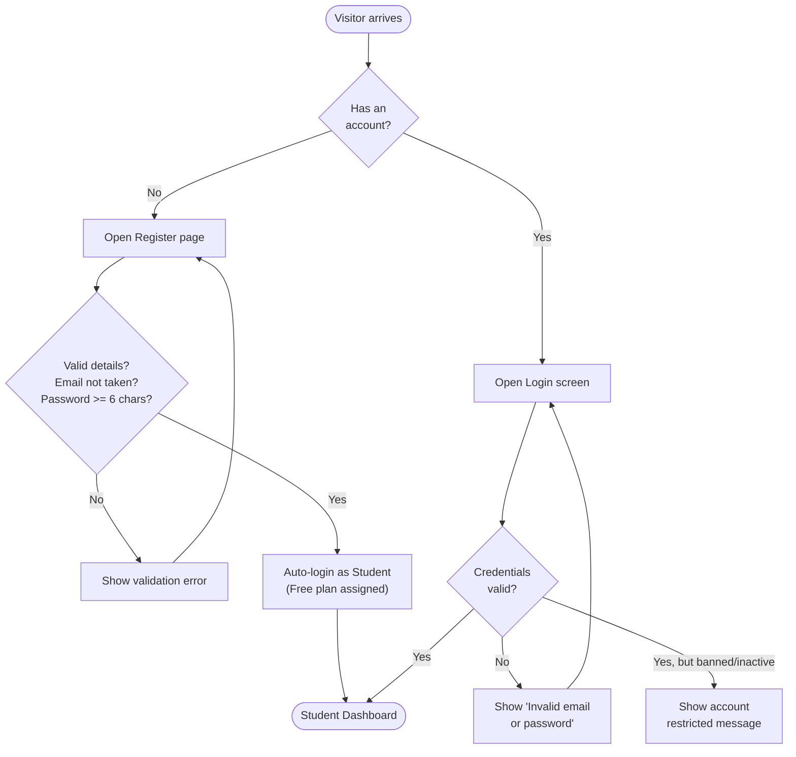
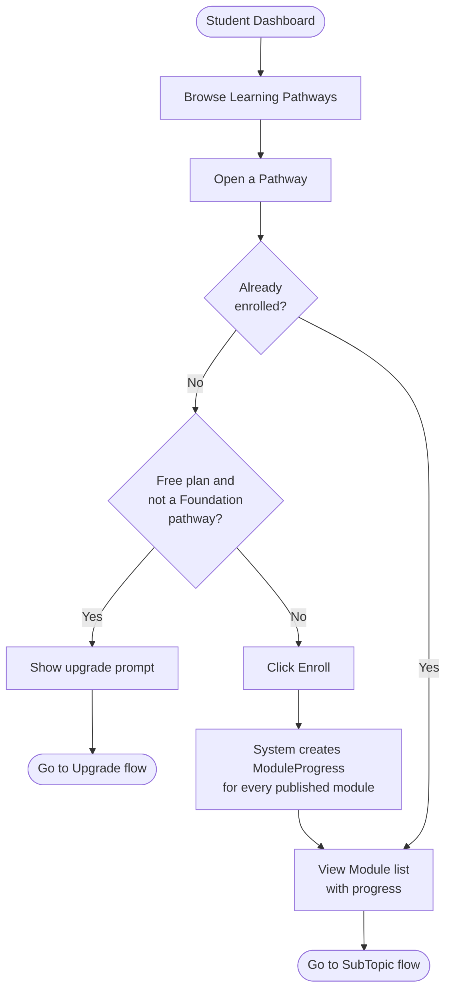
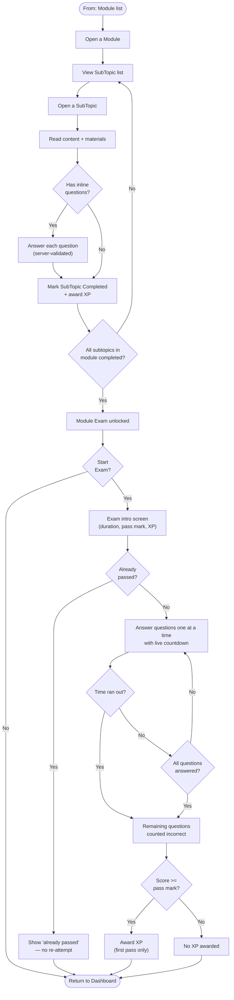
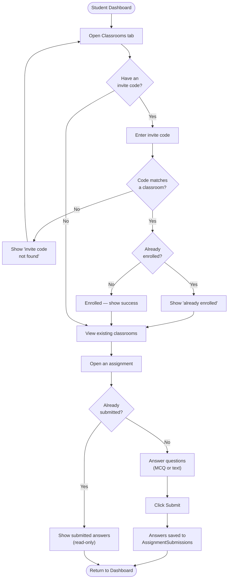
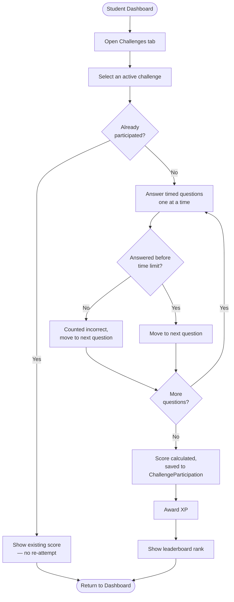
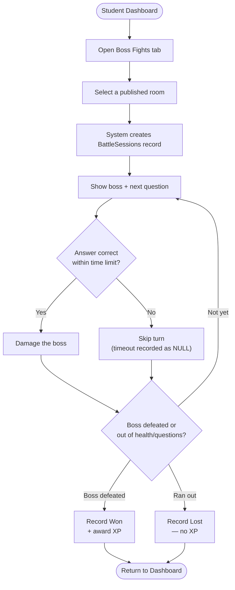
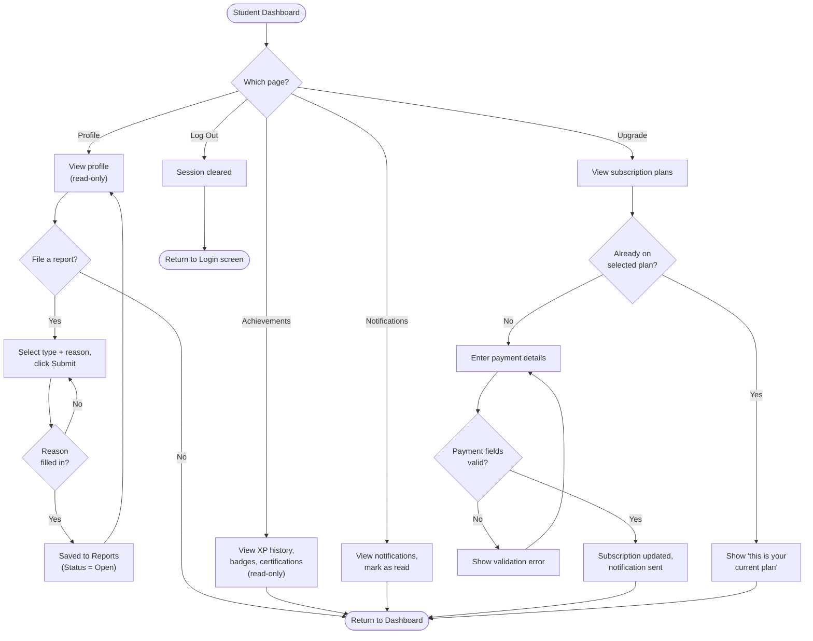
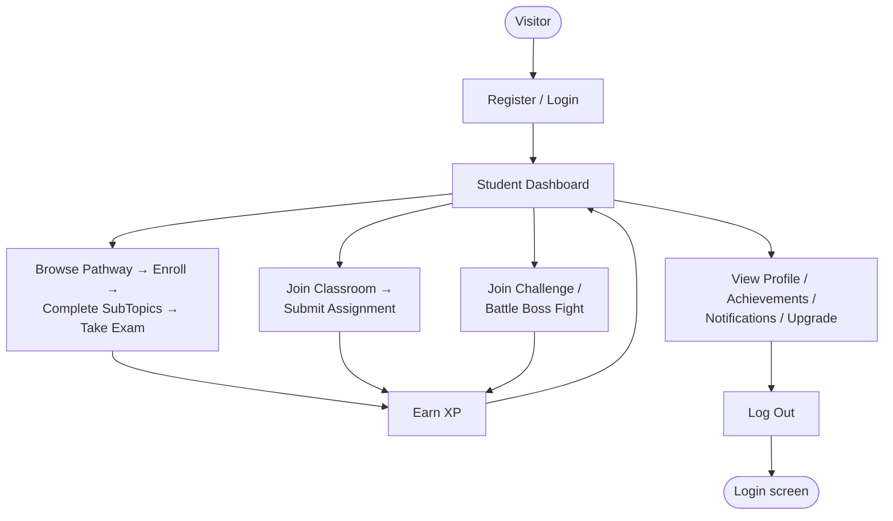

# CloudPhoria — Student Flowcharts (Split by Feature)

> Drafting aid only — not referenced by the project, safe to delete anytime, does not affect the build. Split into 7 smaller flowcharts instead of one large diagram, so each one is readable on its own and can be dropped into a separate slot in your report. Each renders on https://mermaid.live (paste the code block without the triple backticks) or in VS Code with the Mermaid preview extension.

---

## 1. Authentication (Login / Register)

---

## 2. Learning Pathway → Enrollment

---

## 3. SubTopic Completion → Module Exam

---

## 4. Classroom (Join → Assignment Submission)

---

## 5. Challenges (Time-boxed Quiz)

---

## 6. Boss Fight (Battle Loop)

---

## 7. Account (Profile / Report / Achievements / Notifications / Upgrade)

---

## How to view/export these

- **Quickest:** paste any single code block above (without the triple backticks) into https://mermaid.live — renders instantly, export as PNG/SVG for your report.
- **In VS Code / Kiro:** install the "Markdown Preview Mermaid Support" extension, open this file, use the Markdown preview — all 7 render inline.
- **In your Word report:** render each on mermaid.live, screenshot or export as image, paste into the relevant section (e.g. flowchart #3 next to your "Take Module Exam" use case description).

## Notes

- Each flowchart starts and ends at a shared point (Dashboard) so they can be read independently, but you can see how they connect if you look at flowcharts 2 and 3 together (Pathway enrollment feeds into the SubTopic/Exam flow).
- Flowchart 3 shows the enrollment/completion precondition chain that was corrected in the use case audit (`CloudPhoria_UseCase_Student_Audit.md`) — a module's exam only unlocks after all its subtopics are completed.
- Flowchart 7's Achievements branch has no "badge awarded" step, since no code path in the system currently awards a badge or certification (verified: zero `INSERT INTO UserBadges`/`UserCertifications` anywhere in the codebase) — only XP is genuinely automatic.
- If you want the Guest-only preview behavior (browse without login) broken out as its own 8th flowchart, just ask.

---

## 0. Simple Overview Flowchart (high-level only)

If you just need one clean, simple diagram showing the overall Student journey without all the branching detail, use this instead:

This is the one to use if your report just needs a quick, readable visual rather than full decision logic — paste it into https://mermaid.live the same way as the others.
