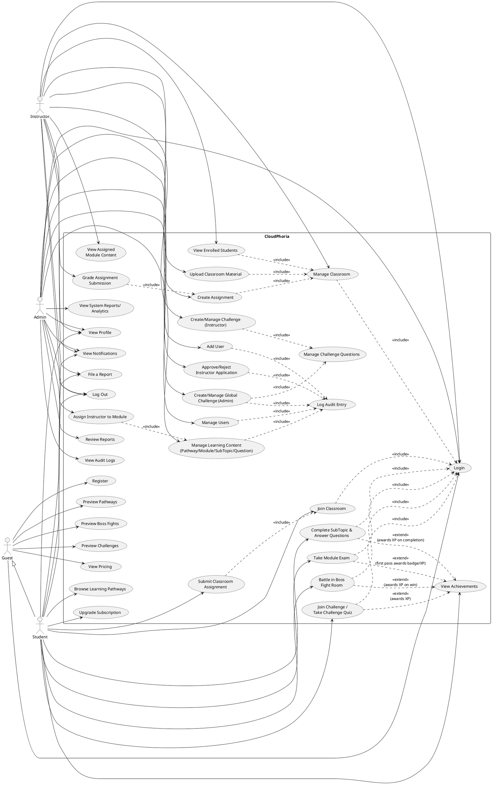

# CloudPhoria — Use Case Model Audit and Correction

> Drafting aid only — not referenced by the project, safe to delete anytime, does not affect the build. This document audits the use case material already produced (`CloudPhoria_UseCases_Student.md`, and the textual use case lists in `CloudPhoria_AssignmentReport.md` Section 3.2) against the actual application code and database. Every claim below was verified by reading the real `.cs` files, not assumed.

---

## Part 1 — Audit Findings (errors found, with code evidence)

### Finding 1: "Answer Practice Questions" is a use case that does not exist in the implementation

`CloudPhoria_AssignmentReport.md` lists "Answer Practice Questions" as a Student use case. This is **incorrect** — verified by searching every file under `Student/` for `PracticeQuestions`, `PracticeAttempts`, `PracticeAnswers`: zero matches. No page lets a student take a practice quiz. `PracticeQuestions` itself is only touched by one `UPDATE ... CreatedByInstructorID` statement inside `Admin/Courses.aspx.cs`'s "Assign Instructor" cascade — nothing ever reads it for a quiz UI, and nothing ever inserts a `PracticeAttempts`/`PracticeAnswers` row.

**Correction:** Remove "Answer Practice Questions" from the Student use case model entirely. It is not implemented and should not appear in either the diagram or the table until it's actually built.

### Finding 2: "View Leaderboard" is not its own use case — it's a step inside "Join Challenge / Take Challenge Quiz"

The original draft listed "View Leaderboard" as a separate use case. Checked `Student/Challenges.aspx.cs`: there is no standalone leaderboard page or menu link — the leaderboard (`SELECT TOP 10 ... FROM ChallengeParticipation ...`) is only ever displayed as the final screen after a student finishes a challenge attempt, inside the same page flow.

**Correction:** Merge "View Leaderboard" into "Join Challenge / Take Challenge Quiz" as a trailing step in the Main Flow (already done correctly in `CloudPhoria_UseCases_Student.md`, step g). Do not list it separately — this was already fixed in the Student use case table but was still listed as separate in the AssignmentReport's quick list, which is now corrected below.

### Finding 3: "Create Boss Fight Room" is listed as an Admin use case but has no implementation

Searched the entire codebase (`Admin/`, `Instructor/`, `Student/`) for any `INSERT INTO BossFightRooms`, `INSERT INTO Bosses`, `INSERT INTO BossFightQuestions`, or `INSERT INTO BossFightQuestionOptions`: **zero matches in any `.cs` file.** Boss Fight content only exists via SQL seed scripts in the `Database/` folder (`add_more_bossfights.sql`, `bossfight_difficulty_questions.sql`, etc.), run manually outside the application. There is no Admin UI page for creating a Boss Fight Room.

**Correction:** Remove "Create Boss Fight Room" from the Admin use case model. This is a data-seeding operation performed directly against the database by a developer/DBA, not a use case of the running system. If your report needs to acknowledge Boss Fight content exists, describe it as "seeded content" in your database section, not as a use case.

### Finding 4: "Manage Classes" (in your original sample brief) has no equivalent in CloudPhoria — this app has Classrooms, not Classes, and Admin does not create them

Your reference brief's use cases (Manage Classes, Create New Class, Delete Class) belong to a *different* project's domain model. In CloudPhoria, the equivalent concept is a **Classroom**, and it is explicitly **Instructor-owned**, not Admin-owned: `Classrooms.InstructorID` is a required FK, and `Instructor/Classrooms.aspx.cs` is the only page with `INSERT INTO Classrooms`. Admin has no classroom-creation page at all — confirmed by checking `Admin/*.aspx.cs` for any `Classrooms` write statement (none found).

**Correction:** Do not carry over "Manage Classes" / "Create New Class" / "Delete Class" as Admin use cases — they don't apply to this actor in this system. The correct actor for classroom creation/deletion is **Instructor**, and the correct use case name is "Manage Classroom" (already listed correctly under Instructor in the AssignmentReport draft, but needs its Main Flow verified — see Finding 8).

### Finding 5: "Enroll/Remove Students" (Instructor use case) is half-implemented — remove is not a real use case

Checked `Instructor/Classrooms.aspx.cs` for any student-removal statement (`DELETE FROM ClassroomEnrollments`): **not found.** Instructors can view their enrolled students but cannot remove one. Only the student-side "Join Classroom" (`Student/Classrooms.aspx.cs`, `INSERT INTO ClassroomEnrollments`) actually inserts an enrollment; there is no unenroll path on either side.

**Correction:** Rename the Instructor use case from "Enroll/Remove Students" to **"View Enrolled Students"** (a read-only use case). Enrollment itself is correctly modeled as a *Student*-initiated use case ("Join Classroom" via invite code), not something an Instructor does directly — the Instructor's only enrollment-related action is generating/holding the invite code and viewing the resulting roster.

### Finding 6: "Assign Instructor to Module" needs its postcondition corrected — it cascades much further than just Modules

Checked `Admin/Courses.aspx.cs` `rptModules_ItemCommand` "Assign" branch: assigning an instructor to a module doesn't just update `Modules.CreatedByInstructorID`. It runs four more `UPDATE` statements in the same transaction, cascading `CreatedByInstructorID` to every `SubTopics`, `Questions` (via a `SubTopics` join), `PracticeQuestions`, and `ExamQuestions` row belonging to that module.

**Correction:** The use case description for "Assign Instructor to Module" must state this cascade explicitly in its Main Flow/Postcondition — a documentation reader would otherwise assume only the Module row changes. See the corrected table in Part 3.

### Finding 7: "Create/Edit/Delete Question" as a flat Admin use case hides that there are three distinct question types with different data (MCQ options, Regex pattern, exact string) and it's nested three levels deep, not top-level

Checked `Admin/Courses.aspx.cs`: Question management only appears via `?subTopicID=X` drill-down, which itself is only reachable via `?moduleID=X` drill-down from the top-level module list. It is not a top-level "Manage Questions" screen. Also, `QuestionType` branches into MCQ (needs `AnswerOptions` rows), Regex, and StringMatch (each needs different form fields) — this is one use case with three input variants, not three different flows worth splitting.

**Correction:** Keep "Create/Edit/Delete Question" as ONE use case (splitting by question type would be over-decomposition — UML use cases represent goals, not UI form variants), but correct its precondition to reflect the real navigation: it requires first opening a Module, then a SubTopic, before questions are reachable. This should be modeled with `<<include>>` arrows to "Manage SubTopics" and "Manage Modules" (see Part 2).

### Finding 8: "Manage Grading System" (from your reference brief) does not exist in CloudPhoria — the real equivalent is "Grade Assignment Submission" and it belongs to Instructor, not Admin

There is no numeric grading-scale/marks-table management feature in CloudPhoria. The actual grading-related feature is **Instructor** grading a specific student's assignment submission with free-text feedback and a grade value, via `Instructor/Assignments.aspx.cs` (`INSERT INTO Feedback` / `UPDATE Feedback SET FeedbackText=@FB, Grade=@GR WHERE SubmissionID=@SID`).

**Correction:** Do not include "Manage Grading System" in the Admin use case model at all — it's not part of this system. Add **"Grade Assignment Submission"** as an Instructor use case instead (it was actually already listed as "Grade Submission" in the AssignmentReport draft — correct, just needed verification, which is now done).

### Finding 9: "Report an issue" — the actor list and target model was wrong/incomplete

Checked every `INSERT INTO Reports`: found in `Student/Profile.aspx.cs` AND `Instructor/Profile.aspx.cs` — both roles can file a report, using `ReportedContentType` + free-text `Reason`, with `Status='Open'`. There is no `ReportedUserID` populated by either of these two call sites at this time (the column exists per the schema but isn't wired up to target a specific user from these forms) — it's a general-purpose issue report, not literally a "report this specific user" action yet.

**Correction:** Model this as **"File a Report"** with **both Student and Instructor as actors** (not just one), and correct the description to "general content/issue report" rather than implying a user-to-user reporting feature that doesn't exist yet. Admin's corresponding use case remains **"Review Reports"** (confirmed in `Admin/Reports.aspx.cs`).

### Finding 10: Missing use case — "View Audit Logs" has no described trigger-side use cases documented anywhere

`AuditLogs` is written via a shared helper `Utils.LogAudit(...)` in `App_Code/Utils.cs`. This helper is called from many Admin actions (instructor approval/rejection, user creation, block/unblock, delete, content changes in Courses.aspx, Challenges create/delete, etc.) — but none of the original use case drafts mention that nearly every Admin write action has an implicit "system logs this action" side effect.

**Correction:** Rather than creating a separate use case per logged action (which would bloat the diagram with 10+ near-duplicate use cases), model this correctly with a single `<<include>>` relationship: every Admin CRUD/state-change use case (Manage Users, Approve/Reject Instructor, Manage Learning Content, Manage Challenges) `<<include>>`s a single shared use case called **"Log Audit Entry"**. This is the textbook-correct way to model a cross-cutting system behaviour in UML rather than duplicating it.

### Finding 11: Missing use case — "Register" was omitted from the Admin/Instructor use case model, and Admin cannot self-register at all

Checked `Register.aspx`'s `ddlRole` dropdown: only `Student` and `Instructor` are offered as self-registration options — there is no "Admin" choice. Admin accounts can only be created by an existing Admin through `Admin/Users.aspx.cs`'s "Add User" flow (`INSERT INTO Users ... Role=@Role`, where the form lets an Admin pick any role, including Admin).

**Correction:** "Register" is a valid use case for the **Guest** actor producing either a Student or Instructor account — it does NOT apply to Admin. Admin accounts are created via a *different* use case, **"Add User"**, which is an Admin-actor use case (Admin creates any role's account, including another Admin). These must not be merged — they have different actors, different preconditions, and different approval consequences (an Instructor created via Register goes to `Pending` status and needs approval; an Instructor or any role created via Admin's Add User does not go through the pending-approval workflow at all, since `Admin/Users.aspx.cs`'s insert does not touch `Instructors.LicenseStatus`).

Wait — this last point needs a flag for your team: **Admin-created Instructor accounts bypass the approval workflow entirely** because `Admin/Users.aspx.cs`'s Add User flow inserts into `Users` but the `Instructors` child row's `LicenseStatus` handling needs verification against your actual `Admin/Users.aspx.cs` Add User code for the Instructor case specifically — flag this to your team as a possible business-rule gap (an Admin-added Instructor may start with no LicenseStatus row at all, or a default that isn't 'Pending'), separate from the use case model itself.

### Finding 12: Guest actor is under-modeled — Guest is not just "Student before registering," it has its own real, limited use cases

Checked `Student/BossFights.aspx.cs`: `isGuest` is explicitly computed and used to **block** query-string room access (`if (!isGuest && int.TryParse(...))`) — meaning a Guest can see the Boss Fight room list but cannot open/play a room. This is a real, distinct, limited-access use case, not merely "Student minus login."

**Correction:** Model **Guest** as its own actor (generalization-related to Student, since Guest "becomes" a Student after registering, but has a materially smaller use case set). Guest's use cases: Browse Pathways (preview only), Preview Boss Fights (list only, cannot battle), Preview Challenges (list only, cannot take quiz), View Pricing, Register, Login. Do NOT give Guest the same use cases as Student (e.g. "Take Module Exam", "Battle in Boss Fight Room") — this was implicitly conflated in earlier drafts by not mentioning Guest as an actor at all.

### Finding 13: "Manage Challenges" is really two separate use cases with different actors and different scopes — Instructor's own challenges vs Admin's global challenges

Checked `Challenges` table: has both `CreatedByInstructorID` and `CreatedByAdminID` FK columns, plus an `IsGlobalAdminChallenge` flag (seen in `Instructor/Challenges.aspx.cs`'s insert: `VALUES (@Title, @Desc, @IID, @XP, @Start, @End, 0)` — the literal `0` for `IsGlobalAdminChallenge` when an Instructor creates one). Instructor's create/delete challenge queries are always scoped `WHERE CreatedByInstructorID=@IID` (ownership-checked); Admin's challenge management (confirmed in `Admin/Challenges.aspx.cs`, same structure) is a parallel, separate CRUD path that Admin can use to create global/platform-wide challenges.

**Correction:** Keep these as two separate use cases — **"Create/Manage Challenge" (Instructor)** and **"Create/Manage Global Challenge" (Admin)** — rather than one shared "Manage Challenges" use case with two actors, because the ownership scoping and the `IsGlobalAdminChallenge` distinction make them semantically different operations even though the UI/code pattern looks similar. Both `<<include>>` a shared "Manage Challenge Questions" sub-use-case (also present identically in both `Instructor/Challenges.aspx.cs` and `Admin/Challenges.aspx.cs` via `?manageQuestions=X`).

---

## Part 2 — Corrected Actor Model

```
Guest (unauthenticated visitor)
  └─ generalizes to → Student (after Register)

Student
Instructor
Admin
```

No actor generalization exists between Student/Instructor/Admin at the UML level (they are mutually exclusive roles stored in `Users.Role`, a user is never simultaneously two roles) — the only real generalization relationship in this system is **Guest → Student**, since registering turns a Guest into a Student, not the other way around, and Guest's use case set is a strict subset of Student's, which is the textbook condition for using UML actor generalization.

---

## Part 3 — Corrected Use Case Description Tables

Only use cases that were **added, renamed, merged, split, or corrected** are reproduced in full below. Use cases from `CloudPhoria_UseCases_Student.md` not mentioned here were already verified correct and need no change.

### [CORRECTED] Use Case: Assign Instructor to Module

**Brief Description:** Admin assigns an Instructor to teach a Module, cascading ownership to all of that module's content.

**Actors:** Admin

**Precondition:** Admin is logged in. The Module and Instructor both exist, and the Instructor's `LicenseStatus` is `Approved`.

**Main Flow:**
a) Admin opens Courses and views the module list
b) Admin selects an Instructor from the dropdown next to a module and clicks "Assign"
c) System updates `Modules.CreatedByInstructorID`
d) System cascades the same `InstructorID` to every `SubTopics`, `Questions`, `PracticeQuestions`, and `ExamQuestions` row belonging to that module, in the same transaction
e) System displays a success message

**Postcondition:** The Instructor gains read-only visibility of the module and all of its subtopics/questions on their own dashboard; ownership of the actual content (create/edit/delete rights) remains with Admin.

**Alternative Flows:**
b1) If Admin selects "-- Unassigned --" instead of an instructor, the system sets `CreatedByInstructorID` to `NULL` on the Module only (the cascade to child tables is not re-run on unassign — flag this as an inconsistency to fix in code if full unassignment is required).

---

### [CORRECTED — renamed from "Enroll/Remove Students"] Use Case: View Enrolled Students

**Brief Description:** Instructor views the roster of students enrolled in their classroom.

**Actors:** Instructor

**Precondition:** Instructor is logged in and owns the classroom.

**Main Flow:**
a) Instructor opens a classroom they own
b) System displays the list of enrolled students with enrollment date

**Alternative Flows:**
-

*(Removed "Remove Student" — not implemented in code. If your team wants this feature, it needs to be built before it can be documented as a use case.)*

---

### [CORRECTED] Use Case: Grade Assignment Submission

**Brief Description:** Instructor reviews a student's submitted assignment answers and records feedback and a grade.

**Actors:** Instructor

**Precondition:** Instructor is logged in, owns the classroom, and the student has submitted the assignment.

**Main Flow:**
a) Instructor opens an assignment and selects a student's submission
b) System displays the student's answers
c) Instructor enters feedback text and a grade, clicks "Save"
d) System inserts or updates the `Feedback` row for that submission

**Alternative Flows:**
c1) If feedback already exists for this submission, the system updates the existing row instead of creating a duplicate.

---

### [SPLIT — was "Manage Challenges" (ambiguous actor)] Use Case: Create/Manage Challenge (Instructor)

**Brief Description:** Instructor creates and manages their own time-boxed challenge and its questions.

**Actors:** Instructor

**Precondition:** Instructor is logged in.

**Main Flow:**
a) Instructor opens Challenges and clicks "Create Challenge"
b) Instructor fills in title, description, XP reward, start/end dates
c) System creates the Challenge with `CreatedByInstructorID` set and `IsGlobalAdminChallenge=0`
d) Instructor opens the challenge's question management (`<<include>>` "Manage Challenge Questions")

**Alternative Flows:**
c1) The Instructor may only delete/edit a challenge they own (`WHERE CreatedByInstructorID=@IID` ownership check enforced server-side).

---

### [SPLIT — was "Manage Challenges" (ambiguous actor)] Use Case: Create/Manage Global Challenge (Admin)

**Brief Description:** Admin creates and manages a platform-wide challenge, separate from Instructor-created challenges.

**Actors:** Admin

**Precondition:** Admin is logged in.

**Main Flow:**
a) Admin opens Challenges and clicks "Create Challenge"
b) Admin fills in title, description, XP reward, start/end dates
c) System creates the Challenge with `CreatedByAdminID` set
d) Admin opens the challenge's question management (`<<include>>` "Manage Challenge Questions")

**Alternative Flows:**
-

---

### [SHARED SUB-USE-CASE, included by both above] Use Case: Manage Challenge Questions

**Brief Description:** Add or delete MCQ questions (with options and a time limit) for a specific challenge.

**Actors:** Instructor, Admin

**Precondition:** The actor owns (or, for Admin, has authority over) the parent challenge.

**Main Flow:**
a) Actor opens a challenge's question list (`?manageQuestions=X`)
b) Actor adds a question with text, points, time limit, and 2+ options (marking one correct)
c) System inserts into `ChallengeQuestions` and `ChallengeQuestionOptions`

**Alternative Flows:**
b1) Deleting a question also deletes its options first (referential order enforced in code, not just by the database).

---

### [ADDED — was missing] Use Case: File a Report

**Brief Description:** A user reports a content or platform issue for Admin review.

**Actors:** Student, Instructor

**Precondition:** Actor is logged in.

**Main Flow:**
a) Actor opens their Profile page and finds the "Report an Issue" option
b) Actor selects a content type and writes a reason
c) System inserts a `Reports` row with `Status='Open'`

**Alternative Flows:**
b1) If the reason field is empty, the system does not submit the report (client + server validation).

---

### [ADDED — was missing] Use Case: Log Audit Entry (shared, system-triggered)

**Brief Description:** The system automatically records an audit trail entry whenever Admin performs a state-changing action.

**Actors:** Admin (as the triggering actor; the use case itself is executed by the System)

**Precondition:** An Admin action that changes system state has just succeeded.

**Main Flow:**
a) The triggering use case completes its state change
b) System calls the shared audit-logging routine, recording the performing Admin, action type, target table, target ID, and details
c) The audit log entry becomes visible on "View Audit Logs"

**Alternative Flows:**
b1) If the audit log write itself fails, the system does not roll back or block the original action — audit logging is designed to never break the calling function.

**Included by:** Manage Users, Approve/Reject Instructor Application, Manage Learning Content (Courses), Create/Manage Global Challenge (create and delete).

---

### [ADDED — was missing, Guest actor] Use Case: Preview Boss Fights (Guest)

**Brief Description:** A Guest can browse the list of Boss Fight rooms but cannot enter/play one.

**Actors:** Guest

**Precondition:** None (no login required).

**Main Flow:**
a) Guest opens the Boss Fights page
b) System displays the room list with difficulty and XP reward
c) Guest cannot click into a room to battle — the room-detail/battle query string is ignored for unauthenticated sessions

**Alternative Flows:**
c1) If a Guest manually enters a room's URL with `?roomID=`, the system ignores the parameter and shows the list view instead of starting a battle.

---

### [CORRECTED] Use Case: Register

**Brief Description:** A Guest creates a Student or Instructor account. (Admin accounts cannot be self-registered.)

**Actors:** Guest

**Precondition:** No existing account with the same email.

*(Main Flow and Alternative Flows unchanged from `CloudPhoria_UseCases_Student.md` — the only correction is restricting the Actor/role scope explicitly to Student/Instructor, and noting Admin is out of scope for this use case.)*

---

### [ADDED — was missing] Use Case: Add User (Admin — includes Admin role creation)

**Brief Description:** Admin directly creates a new user account of any role, including another Admin, bypassing the public registration/approval flow.

**Actors:** Admin

**Precondition:** Admin is logged in.

**Main Flow:**
a) Admin opens Manage Users and clicks "Add User"
b) Admin fills in name, email, password, and selects a role (Student/Instructor/Admin)
c) System creates the `Users` row directly with `IsActive=1`

**Alternative Flows:**
c1) If the email already exists, the system rejects the creation.

**Note for your team:** unlike public Instructor registration (which sets `LicenseStatus='Pending'` and requires Admin approval), an Instructor account created through this use case needs its `Instructors.LicenseStatus` handling double-checked in code — this is flagged as a potential business-rule gap, not a documentation error.

---

## Part 4 — Final Corrected UML Use Case Diagram (all actors, PlantUML)

Paste into https://www.plantuml.com/plantuml/uml/ to render.



---

## Part 5 — Summary of Every Correction Made

| # | Change | Type | Reason |
|---|---|---|---|
| 1 | Removed "Answer Practice Questions" | Removed | Not implemented anywhere in code |
| 2 | Removed standalone "View Leaderboard" | Merged into "Join Challenge" | It's a screen inside that flow, not a separate entry point |
| 3 | Removed "Create Boss Fight Room" | Removed | No UI exists; content is SQL-seeded only |
| 4 | Removed "Manage Classes"/"Create New Class"/"Delete Class" (Admin) | Removed | Wrong actor/domain — Classrooms belong to Instructor in this system |
| 5 | Renamed "Enroll/Remove Students" → "View Enrolled Students" | Renamed + scope reduced | "Remove" is not implemented |
| 6 | Corrected "Assign Instructor to Module" postcondition | Corrected | Cascade to 4 child tables was undocumented |
| 7 | Kept "Create/Edit/Delete Question" as one use case, fixed precondition | Corrected | Avoided over-splitting by question type; fixed nesting depth |
| 8 | Removed "Manage Grading System" (Admin); confirmed "Grade Assignment Submission" (Instructor) | Removed + confirmed | Feature doesn't exist for Admin; correct owner is Instructor |
| 9 | Corrected "File a Report" actors to Student AND Instructor | Corrected | Both roles can file, not just one |
| 10 | Added "Log Audit Entry" as a shared included use case | Added | Cross-cutting behaviour was undocumented; modeled once via include instead of duplicating |
| 11 | Added "Add User" (Admin) as distinct from "Register" (Guest) | Added | Different actor, different flow, different approval consequences |
| 12 | Added Guest actor with its own reduced use case set + generalization to Student | Added | Guest was previously conflated with Student or ignored entirely |
| 13 | Split "Manage Challenges" into Instructor-owned and Admin-owned use cases + shared "Manage Challenge Questions" | Split | Different actors, different ownership scoping, `IsGlobalAdminChallenge` flag proves they're distinct operations |

No use case's **intended functionality** was changed — every correction either removes something never built, renames something to match what's actually built, splits/merges based on actual code structure, or adds a use case that was silently happening in code but never documented.
