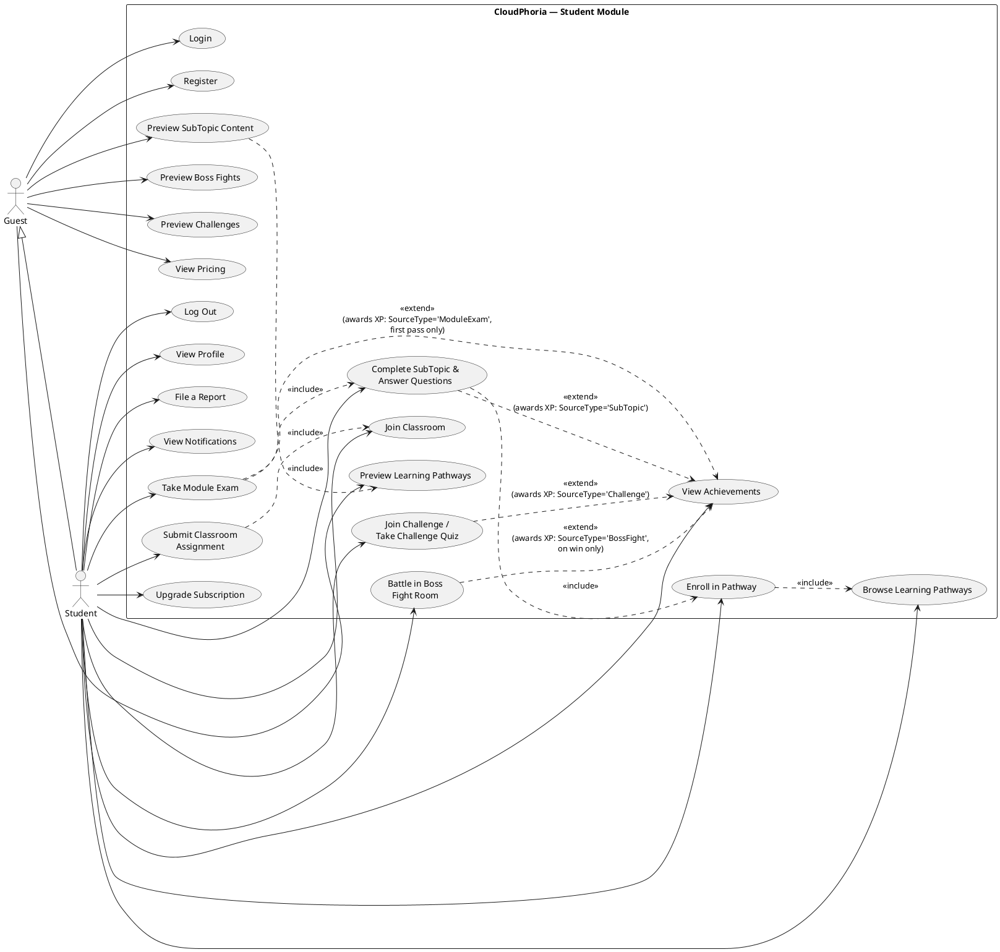

# CloudPhoria — Student Use Case Model: Focused Audit and Correction

> Drafting aid only — not referenced by the project, safe to delete anytime, does not affect the build. Scope: **Student module only.** Other actors (Admin, Instructor) appear ONLY where a Student use case genuinely depends on them as an external actor/dependency (e.g. an Instructor must exist and own a classroom before a Student can join it) — they are not modeled with their own use cases here.
>
> Every finding below was verified by reading the actual code in `Student/*.aspx.cs`, `LogIn.aspx.cs`, `Register.aspx.cs`, and cross-checking against `CloudPhoria_ERD_UsedTables.md`'s live row-count data. This supersedes `CloudPhoria_UseCases_Student.md` for the Student module — that file's Main/Alternative Flows were accurate, but its use case *boundaries* (what's one use case vs two, what's missing, what doesn't exist) had five real errors, detailed below.

---

## Part 1 — Audit Findings

### Finding 1: "Enroll in Pathway" was missing as its own use case — it was silently folded into "Browse Learning Pathways"

Checked `Student/PathwayDetail.aspx.cs`: there is a dedicated `btnEnroll_Click` handler that performs a real, distinct business operation — it bulk-inserts a `ModuleProgress` row (`Status='InProgress'`) for every published module in the pathway that the student doesn't already have progress on. This is gated by subscription tier (`isFreeTier` blocks it and shows an upgrade prompt instead) and is a one-time, deliberate student action with a clear trigger ("Enroll" button) and a clear system effect — it is not just "browsing."

**Correction:** Split "Browse Learning Pathways" (pure read/navigation, no state change) from a new use case **"Enroll in Pathway"** (state-changing: creates `ModuleProgress` rows). This matches the UML principle that a use case represents a discrete goal with an observable result — browsing and enrolling have different triggers, different preconditions (enrolling requires being logged in and non-guest; browsing does not), and different postconditions.

### Finding 2: "View Achievements (Badges & Certifications)" describes a use case whose backing data-write path does not exist anywhere in the codebase

Searched the entire codebase for `INSERT INTO UserBadges` and `INSERT INTO UserCertifications`: **zero matches in any file.** Cross-checked against `CloudPhoria_ERD_UsedTables.md`'s live database row counts: `UserBadges` = 0 rows, `UserCertifications` = 0 rows. The `Badges` (28 rows) and `Certifications` (6 rows) definition tables are seeded and readable, and `Student/Achievements.aspx.cs` correctly queries `UserBadges`/`UserCertifications` for display — but nothing in the entire system ever writes a row into either "earned" table. A student can never actually earn a badge or certification with the current code, even though the UI to view them exists and is fully wired for reading.

**Correction:** Keep "View Achievements" as a use case (the page is real and functional as a read-only viewer), but its Main Flow must be corrected to remove any implication that badges/certifications are awarded automatically by other use cases — no such trigger exists. The `<<extend>>` relationships from "Take Module Exam" and other use cases into "View Achievements" that appeared in the earlier (non-Student-scoped) audit document were **overstated for badges/certifications specifically** — XP *is* genuinely awarded by those use cases (verified `INSERT INTO XPTransactions`), but badges and certifications are not. This is flagged as a business-logic gap for your team, separate from the documentation fix.

### Finding 3: "File a Report" was completely missing from the Student use case list

Checked `Student/Profile.aspx.cs`: there is a working `btnSubmitReport_Click` handler that inserts into `Reports` with `Status='Open'` and a confirmation message ("Report submitted. An admin will review it shortly."). This is a real, independent use case triggered from the Profile page, not a sub-step of "View Profile."

**Correction:** Add **"File a Report"** as its own Student use case. It is correctly modeled with an `<<include>>` dependency on Admin's report-review process as an external continuation, but Admin is not given its own use case node in this Student-scoped diagram (per your instruction to only include other actors as dependencies, not full use cases).

### Finding 4: "View Profile" needs its scope corrected — there is no profile-editing capability for Students

Checked `Student/Profile.aspx.cs` in full: it only *displays* `FullName`, `Email`, `TPNumber`, `CreatedAt`, `TotalXP`, plan, module/badge/cert counts. There is no `UPDATE Users` or `UPDATE Students` statement anywhere in this file. The only interactive control on this page is the report-submission form (Finding 3).

**Correction:** The use case must be named **"View Profile"**, not "Edit Profile" or "Manage Profile" — no editing capability exists. Do not imply edit capability in the Main Flow (this wasn't explicitly claimed in the prior document, but it's worth confirming explicitly since your reference brief's Admin section had an "Update User Details" use case that could tempt someone to assume Students have the same for their own profile — they do not).

### Finding 5: "Take Module Exam" and "Complete SubTopic" both silently depend on pathway enrollment — this precondition was missing

Checked `Student/ModuleDetail.aspx.cs`: if a student is not enrolled in the module's pathway (`isEnrolled` check against `ModuleProgress`), the system **redirects to PathwayDetail instead of showing the module** — meaning a student cannot reach a SubTopic or sit an exam for a module in a pathway they haven't enrolled in yet, even if they somehow have the direct URL. This is an enforced precondition at the code level, not just a UI convenience.

**Correction:** Add `<<include>>` from both "Complete SubTopic & Answer Questions" and (transitively) "Take Module Exam" to "Enroll in Pathway" (the new use case from Finding 1), since exam-taking requires all subtopics completed, and subtopics require pathway enrollment first. This creates a correct three-level include chain: Take Module Exam → (requires) Complete SubTopic → (requires) Enroll in Pathway.

### Finding 6: Guest's use case set needs one addition and one correction — "Preview SubTopic Content" exists and is distinct from full "Complete SubTopic"

Checked `Student/SubTopicView.aspx.cs`: a Guest (`isGuest = true`) can open a SubTopic and see its content and materials, but the progress-tracking block, the interactive Questions panel, and the "Mark Complete" button are all skipped (`if (!isGuest) { ... } else { pnlGuestPrompt.Visible = true; }`). This is a genuine, distinct, limited use case — not the same as "Complete SubTopic," and not previously documented anywhere (the earlier cross-actor audit only mentioned Guest previewing Boss Fights/Challenges/Pathways, missing SubTopic preview).

**Correction:** Add **"Preview SubTopic Content" (Guest)** as a Guest use case, distinct from "Complete SubTopic & Answer Questions" (Student-only, requires login, writes progress). Also confirmed: Guest can reach `ModuleDetail.aspx` and `PathwayDetail.aspx` in preview form too (subtopic lists render, but enroll/progress actions are hidden/blocked) — these are already covered generically by "Browse Learning Pathways (Guest preview)" and do not need further splitting.

### Finding 7: The subscription/paywall check is one shared precondition, not three separate business rules — verified identical logic exists in three files

Checked `Student/PathwayDetail.aspx.cs`, `Student/ModuleDetail.aspx.cs`, and `Student/SubTopicView.aspx.cs`: all three run the exact same query pattern (`SELECT TOP 1 sp.CanAccessFoundationOnly FROM UserSubscriptions us INNER JOIN SubscriptionPlans sp ...`) to decide whether non-Foundation content is blocked for a Free-tier student. This is correctly one cross-cutting precondition, not three different use cases — the earlier audit didn't explicitly call this out as a shared rule.

**Correction:** Document this once, explicitly, as a shared precondition/extend point: **"Browse Learning Pathways," "Enroll in Pathway," and "Complete SubTopic"** all `<<extend>>` from a conceptual "Subscription Gate Check" — however, since this is a precondition check rather than optional bonus behaviour, it is more UML-correct to state it as a **shared precondition in the Use Case Specification table** rather than draw it as a separate use case bubble on the diagram (drawing a use case for "check my own precondition" is a common student mistake in UML — a precondition check that always runs and has no independent trigger is not a use case on its own).

---

## Part 2 — Corrected Actor Model (Student module scope only)

```
Guest (unauthenticated visitor)
  └─ generalizes to → Student (after Register)
```

External dependency actors referenced but NOT modeled with their own use cases in this diagram (per your instruction):
- **Instructor** — owns the Classroom a Student joins, owns the Assignment a Student submits, owns the Challenge a Student may join (or it may be Admin-owned/global).
- **Admin** — reviews Reports filed by Students; may also create global Challenges and all Boss Fight Rooms (both are consumed, not created, by Students).

---

## Part 3 — Corrected Student Use Case List (final, this document supersedes the prior Student list)

1. Login
2. Register
3. Browse Learning Pathways
4. **Enroll in Pathway** *(NEW — split out of Browse Learning Pathways)*
5. Complete SubTopic & Answer Questions
6. Take Module Exam
7. Join Classroom
8. Submit Classroom Assignment
9. Join Challenge / Take Challenge Quiz
10. Battle in Boss Fight Room
11. View Achievements *(corrected — read-only viewer, XP-only auto-award, no badge/cert auto-award exists)*
12. Upgrade Subscription
13. View Profile *(corrected — explicitly read-only, no edit capability)*
14. **File a Report** *(NEW — was missing entirely)*
15. View Notifications
16. Log Out

Guest-only (reduced) use cases:
17. Preview Learning Pathways (Guest)
18. **Preview SubTopic Content (Guest)** *(NEW — distinct from full Complete SubTopic)*
19. Preview Boss Fights (Guest)
20. Preview Challenges (Guest)
21. View Pricing (Guest)

---

## Part 4 — Corrected Use Case Description Tables (new/changed use cases only)

Use cases not listed here (Login, Complete SubTopic, Take Module Exam, Join Classroom, Submit Assignment, Join Challenge, Battle Boss Fight, Upgrade Subscription, View Notifications, Log Out, Register) are unchanged from `CloudPhoria_UseCases_Student.md` and remain valid as written there — only their *relationships* changed (see Part 5 diagram). Full tables below are only for use cases that are new, split, merged, or materially corrected.

---

### [NEW — split from "Browse Learning Pathways"] Use Case: Enroll in Pathway

**Brief Description:** A logged-in student commits to a learning pathway, creating progress records for all its published modules.

**Actors:** Student

**Precondition:** Student is logged in, is not a Guest, and either the pathway is a Foundation (free) pathway or the student holds a Pro/Student subscription plan.

**Main Flow:**
a) Student opens a Pathway they have browsed
b) System shows an "Enroll" call-to-action if the student has no existing progress in this pathway
c) Student clicks "Enroll"
d) System inserts a `ModuleProgress` row with `Status='InProgress'` for every published module in the pathway that the student doesn't already have progress on
e) System redisplays the pathway page, now showing enrolled/in-progress state and per-module exam availability

**Postcondition:** The student can now open any module in this pathway and see subtopics; module exams become reachable once each module's subtopics are completed.

**Alternative Flows:**
b1) If the student is on the Free plan and the pathway is not a Foundation pathway, the system shows an upgrade prompt instead of the Enroll button, and enrollment is blocked.
b2) If the student has already enrolled (has any `ModuleProgress` row for a module in this pathway), the system shows their progress instead of an Enroll button.

---

### [CORRECTED] Use Case: View Achievements

**Brief Description:** A student views their earned XP history, and any badges/certifications that have been earned (currently none are ever awarded — see note).

**Actors:** Student

**Precondition:** Student is logged in.

**Main Flow:**
a) Student opens the Achievements page
b) System displays total XP, a list of earned badges (via `UserBadges`), a list of earned certifications (via `UserCertifications`), and the last 20 XP transactions

**Alternative Flows:**
b1) If the student has no badges or certifications yet, the system shows an empty-state message instead of a list.

**Implementation note (not a UML correction, a code-gap flag for your team):** `UserBadges` and `UserCertifications` are never written to by any code path in the current system — the awarding logic for badges/certifications has not been implemented, even though the definition tables (`Badges`, `Certifications`) and the viewing UI are complete. Only XP (`XPTransactions`) is genuinely awarded automatically by SubTopic completion, Module Exam passes, Challenges, and Boss Fights. If your report needs to describe "earn badges" as a feature, be accurate that it is designed but not yet functional.

---

### [CORRECTED] Use Case: View Profile

**Brief Description:** A student views their own account and learning statistics (name, email, TP number, join date, total XP, current plan, modules completed, badge/certification counts). No editing capability exists.

**Actors:** Student

**Precondition:** Student is logged in.

**Main Flow:**
a) Student opens the Profile page
b) System displays the student's account and progress summary, read-only

**Alternative Flows:**
-

---

### [NEW — was missing entirely] Use Case: File a Report

**Brief Description:** A student submits a report about a content or platform issue for Admin review.

**Actors:** Student *(external dependency: Admin reviews the report — not modeled as a full use case in this Student-scoped diagram)*

**Precondition:** Student is logged in.

**Main Flow:**
a) Student opens their Profile page and finds the "Report an Issue" section
b) Student selects a content type and writes a reason, clicks "Submit"
c) System inserts a `Reports` row with `Status='Open'` and displays "Report submitted. An admin will review it shortly."

**Alternative Flows:**
b1) If the reason field is empty or invalid, the system does not submit (client + server validation blocks it).

---

### [NEW — Guest, distinct from Complete SubTopic] Use Case: Preview SubTopic Content (Guest)

**Brief Description:** A Guest can read a subtopic's content and materials, but cannot answer its questions or mark it complete.

**Actors:** Guest

**Precondition:** None (no login required); the subtopic must belong to a published module.

**Main Flow:**
a) Guest opens a SubTopic (typically reached via Preview Learning Pathways)
b) System displays the subtopic's content and any attached learning materials
c) System shows a "Register to unlock questions" prompt instead of the interactive Questions panel

**Alternative Flows:**
-

---

## Part 5 — Revised Student Use Case Diagram (PlantUML, industry-standard UML)

Paste into https://www.plantuml.com/plantuml/uml/ to render.



---

## Part 6 — Summary of Every Correction Made (Student module only)

| # | Change | Type | Code Evidence |
|---|---|---|---|
| 1 | Split "Enroll in Pathway" out of "Browse Learning Pathways" | Split | `PathwayDetail.aspx.cs` `btnEnroll_Click` — distinct trigger, distinct state change (`INSERT INTO ModuleProgress`) |
| 2 | Corrected "View Achievements" to note badges/certifications are never actually awarded | Corrected | Zero `INSERT INTO UserBadges`/`UserCertifications` anywhere in codebase; confirmed 0 rows in live DB |
| 3 | Added "File a Report" (was missing) | Added | `Student/Profile.aspx.cs` `btnSubmitReport_Click` — real, working, independent use case |
| 4 | Corrected "View Profile" to explicitly state no edit capability | Corrected | `Student/Profile.aspx.cs` has zero `UPDATE Users`/`UPDATE Students` statements |
| 5 | Added `<<include>>` chain: Exam → SubTopic → Enroll → Browse | Added relationship | `ModuleDetail.aspx.cs` redirects unenrolled students to PathwayDetail instead of showing content |
| 6 | Added "Preview SubTopic Content" (Guest) as distinct from "Complete SubTopic" | Added | `SubTopicView.aspx.cs` explicitly branches on `isGuest`, hiding progress/questions/complete button |
| 7 | Documented the subscription/paywall check as a shared precondition, not a separate use case | Corrected (no new bubble) | Identical `CanAccessFoundationOnly` query pattern in 3 files — a precondition, not an independently-triggered use case |

No Student use case's intended functionality was changed. Corrections either split a use case that had two genuinely different triggers/effects, added a use case that existed in code but was undocumented, or corrected a description to match what the code actually does (particularly the badges/certifications gap, which is worth raising with your team since it affects how you describe the gamification feature set in your report).
