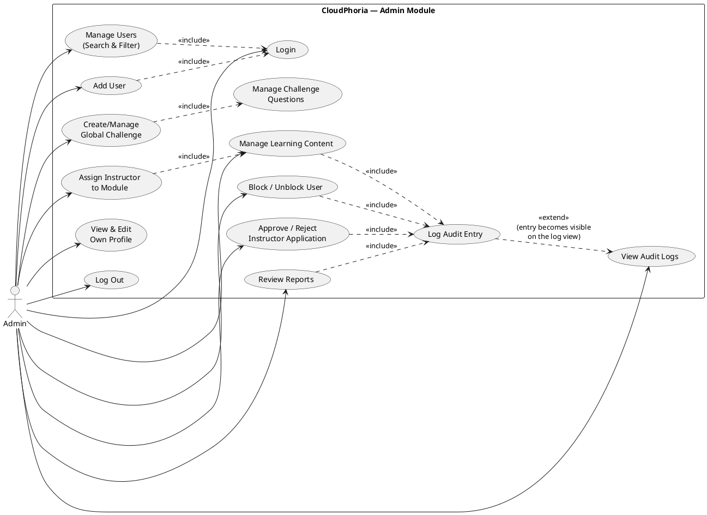

# CloudPhoria — Admin Use Case Tables (Corrected, Code-Verified)

> Drafting aid only — not referenced by the project, safe to delete anytime, does not affect the build. Written in the same format/depth as `CloudPhoria_UseCases_Student.md`. Every use case below was verified directly against `Admin/*.aspx.cs` — nothing here is assumed.

---

## Audit note (read before copying into your report)

Two use cases that appeared in earlier drafts of the cross-role audit (`CloudPhoria_UseCase_Audit.md`) are **not included here** because they don't exist in the current codebase: "Create Boss Fight Room" (no Admin UI writes to `BossFightRooms`/`Bosses` — that content is SQL-seeded only) and "Manage Classes" (Classrooms are Instructor-owned in this system; Admin has no classroom page at all). Including either would misrepresent the actual system.

---

**Use Case:** Login

**Brief Description:** Allows an Admin to log in to the system.

**Actors:** Admin

**Precondition:** Admin has an existing account.

**Main Flow:**
a) Admin opens the login screen and enters email/password
b) System validates credentials and role
c) System redirects to the Admin Dashboard

**Alternative Flows:**
b1) If credentials are wrong, the system displays "Invalid email or password."
b2) If the account is banned/inactive, the system displays a restricted-account message.

**Note:** unlike Student/Instructor, there is no public self-registration path for Admin — `Register.aspx`'s role dropdown only offers Student/Instructor. Admin accounts can only be created by an existing Admin (see "Add User" below).

---

**Use Case:** Manage Users (Search & Filter)

**Brief Description:** Allows an Admin to search and filter the full user list by name/email, role, and account status.

**Actors:** Admin

**Precondition:** Admin is logged in.

**Main Flow:**
a) Admin opens Users, optionally enters a search term and selects role/status filters
b) System queries `Users` with the combined filters and displays matching results with a result count

**Alternative Flows:**
a1) Clicking Clear resets all filters and reloads the full list.

---

**Use Case:** Add User

**Brief Description:** Allows an Admin to directly create a new account of any role — including another Admin — bypassing the public registration/approval flow entirely.

**Actors:** Admin

**Precondition:** Admin is logged in.

**Main Flow:**
a) Admin opens "Add User", enters name, email, password, selects a role (Student/Instructor/Admin)
b) System creates the `Users` row directly with `IsActive=1`

**Alternative Flows:**
b1) If the email already exists, the system rejects the creation.

**Flag for your report/team (not a documentation gap, a real code observation):** this path does not set up an `Instructors.LicenseStatus` row the same way public registration does — an Admin-added Instructor account may need manual follow-up to ensure it has a proper Instructors row with an approved status, since it bypasses the approval workflow that normally creates one. Worth mentioning if your report discusses edge cases or if you want to raise it as a future improvement.

---

**Use Case:** Block / Unblock User (Ban/Unban, Activate/Deactivate)

**Brief Description:** Allows an Admin to ban, unban, deactivate, or reactivate any user account except their own.

**Actors:** Admin

**Precondition:** Admin is logged in; the target user is not the Admin's own account.

**Main Flow:**
a) Admin selects a user from the list and clicks Ban / Unban / Deactivate / Activate
b) System verifies the target is not the current admin (`IsSelf()` check)
c) System updates `Users.IsBanned` or `Users.IsActive` inside a transaction
d) System logs the action to `AuditLogs` in the same transaction (`BAN_USER`, `UNBAN_USER`, `DEACTIVATE_USER`, or `ACTIVATE_USER`)

**Alternative Flows:**
b1) If the Admin targets their own account, the system displays "You cannot modify your own account." and takes no action.
c1) If the update fails partway, the transaction rolls back — the audit log entry and the status change either both happen or neither happens (`tx.Rollback()` on any exception).

*(Code citation: `Admin/Users.aspx.cs` `rptUsers_ItemCommand` — the self-protection check happens before any query runs, and the status update + audit log insert are wrapped in one `SqlTransaction`.)*

---

**Use Case:** Approve / Reject Instructor Application

**Brief Description:** Allows an Admin to review pending Instructor applications and approve or reject them.

**Actors:** Admin

**Precondition:** Admin is logged in; at least one Instructor has `LicenseStatus='Pending'`.

**Main Flow:**
a) Admin opens Instructor Approvals, sees a list of pending applications with qualification details
b) Admin clicks Approve or Reject on an application
c) System updates `Instructors.LicenseStatus`, `ApprovedBy`, `ApprovedAt`
d) System sends a notification to the instructor with the outcome
e) System logs the action to `AuditLogs`

**Alternative Flows:**
-

*(Code citation: `Admin/InstructorApprovals.aspx.cs` — confirmed both the status update and the outbound notification happen for both Approve and Reject, with different message text for each outcome.)*

---

**Use Case:** Manage Learning Content (Pathway / Module / SubTopic / Question — Create, Edit, Publish, Delete)

**Brief Description:** Allows an Admin to fully manage the entire learning-content hierarchy — this is the sole authoring path for all course content in the system.

**Actors:** Admin

**Precondition:** Admin is logged in.

**Main Flow:**
a) Admin opens Courses (top-level: create/list Modules under a Pathway)
b) Admin drills into a Module (`?moduleID=X`) to manage its SubTopics — create, publish/unpublish, delete
c) Admin drills into a SubTopic (`?subTopicID=X`) to manage its Questions (MCQ/Regex/StringMatch) — create with options, delete
d) Every create/publish/delete action logs to `AuditLogs`

**Alternative Flows:**
-

*(Code citation: `Admin/Courses.aspx.cs` — confirmed `INSERT`/`UPDATE`/`DELETE` on `Modules`, `SubTopics`, `Questions`, `AnswerOptions`, each paired with an `AuditLogs` insert.)*

---

**Use Case:** Assign Instructor to Module

**Brief Description:** Allows an Admin to assign an approved Instructor to teach a Module, which cascades read-only visibility of all of that module's content to the instructor.

**Actors:** Admin

**Precondition:** The Module and Instructor exist; the Instructor's `LicenseStatus` is `Approved`.

**Main Flow:**
a) Admin selects an Instructor from a dropdown next to a module and clicks Assign
b) System updates `Modules.CreatedByInstructorID`
c) System cascades the same InstructorID to every `SubTopics`, `Questions`, `PracticeQuestions`, and `ExamQuestions`, and `LearningMaterials` row belonging to that module, in the same transaction

**Alternative Flows:**
a1) Selecting "-- Unassigned --" sets `CreatedByInstructorID` to `NULL` on the Module only (the child-table cascade is not automatically re-run on unassign — a known asymmetry worth mentioning if your report discusses this feature critically).

*(Code citation: `Admin/Courses.aspx.cs` `rptModules_ItemCommand` "Assign" branch — confirmed 5 separate `UPDATE` statements run inside one transaction for every assignment.)*

---

**Use Case:** Create/Manage Global Challenge

**Brief Description:** Allows an Admin to create and manage platform-wide challenges, separate from Instructor-created challenges.

**Actors:** Admin

**Precondition:** Admin is logged in.

**Main Flow:**
a) Admin opens Challenges, clicks Create Challenge, fills in title/description/XP/dates
b) System inserts into `Challenges` with `CreatedByAdminID` set
c) Admin manages the challenge's questions the same way an Instructor would for their own challenge

**Alternative Flows:**
-

*(Modelled as a distinct use case from Instructor's own challenge creation — see `CloudPhoria_UseCase_Audit.md` Finding 13 for why: different ownership column `CreatedByAdminID` vs `CreatedByInstructorID`, and Admin-created challenges are the only ones globally visible platform-wide.)*

---

**Use Case:** Review Reports

**Brief Description:** Allows an Admin to review user-submitted reports and change their status (Reviewed / Action Taken / Dismissed).

**Actors:** Admin

**Precondition:** Admin is logged in; at least one report exists.

**Main Flow:**
a) Admin opens Reports, sees counts by status (Open/Reviewed/ActionTaken/Dismissed) and a filterable list
b) Admin selects a report and clicks Mark Reviewed / Action Taken / Dismiss
c) System updates `Reports.Status` and `ReviewedByAdminID`, and logs the action to `AuditLogs`, in one transaction

**Alternative Flows:**
a1) Filtering by status re-queries and re-displays only matching reports.

*(Code citation: `Admin/Reports.aspx.cs` `rptReports_ItemCommand` — status update and audit log insert are transactional together.)*

---

**Use Case:** View Audit Logs

**Brief Description:** Allows an Admin to view the full history of admin actions performed on the system.

**Actors:** Admin

**Precondition:** Admin is logged in.

**Main Flow:**
a) Admin opens Audit Logs
b) System displays a chronological list of logged actions (who performed it, what action, on what table/target, when)

**Alternative Flows:**
-

**Note for your Design & Modelling section:** this use case is the "read side" of a cross-cutting behaviour — nearly every other Admin use case above (Ban/Unban, Approve/Reject Instructor, Manage Learning Content, Review Reports) writes to this same log as a side effect. The correct way to model this in a UML diagram is a single shared "Log Audit Entry" use case that those other use cases `<<include>>`, rather than duplicating audit-logging as a separate concern per feature (see diagram below).

---

## System Reports / Analytics — clarification, not a separate use case

Your assignment brief may expect a "View System Reports/Analytics" use case for Admin. **This does not currently exist as a distinct feature** — checked `Admin/Dashboard.aspx.cs` and found it shows aggregate stat cards (total users, pending approvals, etc.) as part of the Dashboard landing view, not a separate analytics page. If your brief specifically requires this as its own reporting feature, flag it to your team as a gap; don't document a use case that isn't actually implemented as a distinct page.

---

**Use Case:** View & Edit Own Profile

**Brief Description:** Allows an Admin to view their profile (including aggregate stats: actions logged, instructors approved, reports reviewed, boss fight rooms created) and update their name/email or change their password.

**Actors:** Admin

**Precondition:** Admin is logged in.

**Main Flow:**
a) Admin opens Profile, sees name/email and personal activity stats pulled from `AuditLogs`, `Instructors`, `Reports`, `BossFightRooms`
b) Admin edits name/email and saves
c) Admin may separately change password (current + new, minimum 8 characters)

**Alternative Flows:**
b1) If the new email is already used by another account, the system displays "Email already in use."
c1) If the new password is under 8 characters, the system displays "New password must be at least 8 characters."
c2) If the current password doesn't match, the system displays "Current password is incorrect."

**Implementation note for your report:** Admin's password change properly hashes the new password with SHA-256 before storing (`HashPassword()`), unlike the Instructor profile's password change which stores the new password as plaintext with a `// NOTE: hash before production` comment. This inconsistency between the two roles' profile pages is worth mentioning if your report critically discusses security — it's a real difference in the current code, not a documentation error.

---

**Use Case:** Log Out

**Brief Description:** Ends the Admin's session and returns to the login screen.

**Actors:** Admin

**Main Flow:**
a) Admin clicks Log Out
b) System clears the session and redirects to Login

**Alternative Flows:**
-

---

## Use Case Diagram (Admin) — PlantUML

**Relationship justification:**
- `Add User` `<<include>>`s `Login` — trivial precondition, shown once for clarity rather than on every single use case.
- `Assign Instructor to Module` `<<include>>`s `Manage Learning Content` because you cannot assign an instructor to a module that doesn't exist — the module must already have been created through content management first.
- `Create/Manage Global Challenge` `<<include>>`s `Manage Challenge Questions` for the same reason as the Instructor diagram — a challenge with no questions isn't a completable feature.
- `Block/Unblock User`, `Approve/Reject Instructor`, `Manage Learning Content`, and `Review Reports` all `<<include>>` a shared `Log Audit Entry` use case — every one of these was verified to write an `AuditLogs` row in the same transaction as its main action, so audit logging is mandatory, not optional, for each.
- `Log Audit Entry` `<<extend>>`s `View Audit Logs` — this is the one legitimate `<<extend>>` in the Admin diagram: writing a log entry is a base action, and its *optional, later* effect is that it becomes visible next time someone views the audit log — the viewing use case is extended by the fact that new entries exist, not a mandatory sub-step of logging itself.
