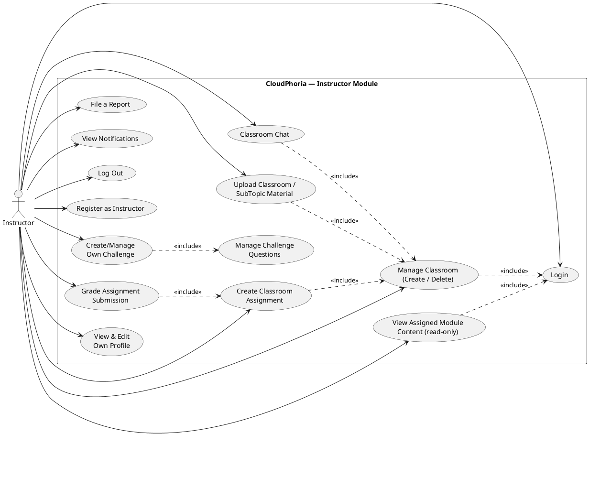

# CloudPhoria — Instructor Use Case Tables (Corrected, Code-Verified)

> Drafting aid only — not referenced by the project, safe to delete anytime, does not affect the build. Written in the same format/depth as `CloudPhoria_UseCases_Student.md`. Every use case below was verified directly against `Instructor/*.aspx.cs` — nothing here is assumed. Where the earlier cross-role audit (`CloudPhoria_UseCase_Audit.md`) had a rough draft, it is corrected here with full Main/Alternative Flows and code citations.

---

## Audit note (read before copying into your report)

The Instructor role's content-authoring pages (`Modules.aspx`, `SubTopics.aspx`, `Questions.aspx`) are **read-only** — confirmed by finding zero `INSERT`/`UPDATE`/`DELETE` statements in any of their three code-behind files. Content ownership belongs entirely to Admin (`Admin/Courses.aspx.cs`), which can optionally *assign* a Module (and its SubTopics/Questions) to an Instructor for teaching visibility only. This is a deliberate, documented decision (see `CloudPhoria_ProjectRules.md` Section 12b) — do not model these as "Create/Edit Module" use cases for Instructor; that would be inaccurate.

---

**Use Case:** Login

**Brief Description:** Allows an Instructor to log in to the system.

**Actors:** Instructor

**Precondition:** Instructor has an existing account.

**Main Flow:**
a) Instructor opens the login screen and enters email/password
b) System validates credentials and checks `Instructors.LicenseStatus`
c) If `Approved`, system redirects to the Instructor Dashboard

**Alternative Flows:**
b1) If credentials are wrong, the system displays "Invalid email or password."
b2) If `LicenseStatus` is `Pending`, the system still logs the instructor in but shows a restricted dashboard view with a "licence pending approval" message — most instructor pages redirect back to the Dashboard until approved.
b3) If `LicenseStatus` is `Rejected`, the system shows "Your instructor licence application was not approved."

---

**Use Case:** Register as Instructor

**Brief Description:** Allows a Guest to apply for an Instructor account, which starts in a Pending state requiring Admin approval.

**Actors:** Guest

**Precondition:** No existing account with the same email.

**Main Flow:**
a) Guest opens Register, selects "Instructor — I want to teach"
b) Guest fills in name, email, password, qualification, and a description of their teaching permit/certification
c) System creates the `Users` row and an `Instructors` row with `LicenseStatus='Pending'`
d) System notifies all Admins of the new pending application
e) System shows a success message but does NOT auto-login (instructor must wait for approval)

**Alternative Flows:**
b1) If qualification or permit description is empty, the system displays a validation error and blocks submission.
c1) If the email is already registered, the system displays "An account with this email already exists."

---

**Use Case:** View Assigned Module Content (read-only)

**Brief Description:** Allows an approved Instructor to view (but not edit) the Modules, SubTopics, and Questions that an Admin has assigned to them for teaching.

**Actors:** Instructor

**Precondition:** Instructor is logged in with `LicenseStatus='Approved'`.

**Main Flow:**
a) Instructor opens Modules, SubTopics, or Questions from the nav
b) System displays only the content where `CreatedByInstructorID` matches this instructor (assigned by Admin)
c) No create/edit/publish/delete controls are shown on these pages

**Alternative Flows:**
b1) If no content has been assigned to this instructor, the system shows an empty state ("Ask an Admin to assign you a module from Manage Courses").

---

**Use Case:** Manage Classroom (Create / Delete)

**Brief Description:** Allows an Instructor to create a classroom with a unique invite code, and delete a classroom they own.

**Actors:** Instructor

**Precondition:** Instructor is logged in and approved.

**Main Flow:**
a) Instructor opens Classrooms and enters a class name + invite code
b) System checks the invite code is not already used, then creates the `Classrooms` row with this instructor as owner
c) Instructor shares the invite code with students so they can join
d) To remove a classroom, the Instructor selects Delete; system deletes it only if `InstructorID` matches the logged-in instructor

**Alternative Flows:**
b1) If the invite code is already in use, the system displays "That invite code is already in use. Please choose another."
d1) If the classroom has related assignments/materials still attached, the delete may fail — the system displays "Could not delete classroom. Remove assignments and materials first."

*(Code citation: `Instructor/Classrooms.aspx.cs` `btnCreate_Click` and `DeleteClassroom` — ownership is enforced with `WHERE ClassroomID=@CID AND InstructorID=@IID` on every mutating query.)*

---

**Use Case:** Classroom Chat

**Brief Description:** Allows an Instructor to send and view chat messages with the students enrolled in one of their classrooms.

**Actors:** Instructor

**Precondition:** Instructor owns the classroom (verified via `OwnsClassroom()` before any chat action).

**Main Flow:**
a) Instructor opens a classroom's chat room from the classroom list
b) System loads the last 100 messages, rendered with sender name/initials and a date separator
c) Instructor types a message and sends it
d) System inserts into `ClassroomMessages` and the chat view refreshes (polling-based, not true real-time push)

**Alternative Flows:**
a1) If the instructor does not own the classroom, `OwnsClassroom()` returns false and the action is silently blocked.

---

**Use Case:** Upload Classroom / SubTopic Material

**Brief Description:** Allows an Instructor to upload files either for a specific classroom (visible to enrolled students) or for a subtopic they've been assigned (visible to all students taking that subtopic).

**Actors:** Instructor

**Precondition:** Instructor owns the target classroom, or the target subtopic has been assigned to them by an Admin.

**Main Flow:**
a) Instructor opens Materials and selects a classroom or subtopic from the upload form
b) Instructor chooses a file and submits
c) System validates the file extension (PDF/DOCX/DOC/PPTX/PPT/TXT/PNG/JPG/JPEG only) and size (max 10 MB)
d) System verifies ownership of the target classroom/subtopic before saving
e) File is saved to `/uploads/materials/` or `/uploads/classroom/{ClassroomID}/` with a sanitised, timestamped filename, and a `LearningMaterials` or `ClassroomMaterials` row is inserted

**Alternative Flows:**
c1) If the file type isn't allowed, the system displays "File type not allowed. Allowed: PDF, DOCX, PPTX, TXT, PNG, JPG."
c2) If the file exceeds 10 MB, the system displays "File exceeds the 10 MB size limit."
d1) If the instructor doesn't own the selected classroom/subtopic, the system displays "You do not own the selected classroom/subtopic." and does not save the file.

*(Code citation: `Instructor/Materials.aspx.cs` `ValidateUploadedFile`, `btnUploadSubtopic_Click`, `btnUploadClassroom_Click`.)*

---

**Use Case:** Create Classroom Assignment

**Brief Description:** Allows an Instructor to create an assignment (title, description, optional due date) for one of their classrooms.

**Actors:** Instructor

**Precondition:** Instructor owns the target classroom.

**Main Flow:**
a) Instructor opens Assignments, selects a classroom, fills in title/description/due date
b) System verifies classroom ownership, then inserts into `ClassroomAssignments`

**Alternative Flows:**
a1) If the instructor has no classrooms yet, the create form is hidden and the system shows a message to create a classroom first.
b1) If ownership verification fails, the system displays "You do not own the selected classroom." and does not create the assignment.

---

**Use Case:** Grade Assignment Submission

**Brief Description:** Allows an Instructor to review a student's submitted answers to an assignment and record feedback text plus a grade.

**Actors:** Instructor

**Precondition:** Instructor owns the classroom that owns the assignment; the student has submitted at least one answer.

**Main Flow:**
a) Instructor opens an assignment, sees a list of students who have submitted
b) Instructor selects a student to view their per-question answers
c) Instructor enters feedback text and a grade for a specific submission, clicks Save
d) System verifies ownership (submission → assignment → classroom → this instructor) before saving
e) System inserts a new `Feedback` row, or updates the existing one if feedback was already given

**Alternative Flows:**
d1) If the submission doesn't belong to a classroom this instructor owns, the system displays "Submission not found or access denied." and does not save.

*(Code citation: `Instructor/Assignments.aspx.cs` `btnSaveFeedback_Click` — the ownership check joins `AssignmentSubmissions` → `ClassroomAssignments` → `WHERE ca.InstructorID = @IID` before any write.)*

---

**Use Case:** Create/Manage Own Challenge

**Brief Description:** Allows an Instructor to create a time-boxed challenge and manage its questions, scoped to their own challenges only.

**Actors:** Instructor

**Precondition:** Instructor is logged in and approved.

**Main Flow:**
a) Instructor opens Challenges, clicks Create Challenge, fills in title/description/XP/dates
b) System inserts into `Challenges` with `CreatedByInstructorID` set and `IsGlobalAdminChallenge=0`
c) Instructor opens the challenge's question management and adds MCQ questions with a time limit and options
d) Instructor may delete a challenge or a question they own

**Alternative Flows:**
d1) Every delete/edit operation checks `WHERE CreatedByInstructorID=@IID` (or via the parent challenge for questions) — an instructor cannot modify another instructor's or Admin's challenge.

*(Note: this is deliberately modelled as a separate use case from Admin's "Create/Manage Global Challenge" — see `CloudPhoria_UseCase_Audit.md` Finding 13 for the reasoning: different ownership column, different `IsGlobalAdminChallenge` flag value, functionally distinct operations sharing similar UI.)*

---

**Use Case:** View & Edit Own Profile

**Brief Description:** Allows an Instructor to view their profile and update their display name and qualification text, or change their password.

**Actors:** Instructor

**Precondition:** Instructor is logged in.

**Main Flow:**
a) Instructor opens Profile, sees name, email (read-only), qualification, licence status badge
b) Instructor edits name/qualification and saves — system updates `Users.FullName` and `Instructors.Qualification` in one transaction
c) Instructor may separately change their password by entering current + new password

**Alternative Flows:**
c1) If the new password doesn't match its confirmation, the system displays "New passwords do not match."
c2) If the new password is under 6 characters, the system displays "New password must be at least 6 characters."
c3) If the current password entered doesn't match the stored value, the system displays "Current password is incorrect."

**Implementation note for your report:** unlike Admin's password change (which hashes with SHA-256 — see Admin Profile use case below), the Instructor password-change path stores the new password directly without hashing (`UPDATE Users SET PasswordHash=@Hash` where `@Hash` is the plaintext new password) — the code has a `// NOTE: In production, hash the new password before storing.` comment acknowledging this. Worth mentioning as a known limitation if your report discusses security, consistent with how the Login page's demo-password fallback is documented elsewhere.

---

**Use Case:** File a Report

**Brief Description:** Allows an Instructor to submit a report about a content or platform issue for Admin review.

**Actors:** Instructor

**Precondition:** Instructor is logged in.

**Main Flow:**
a) Instructor opens Profile, finds the "Report an Issue" section
b) Selects a content type, writes a reason, submits
c) System inserts a `Reports` row with `Status='Open'`

**Alternative Flows:**
b1) If the reason is empty, submission is blocked by validation.

*(Same underlying feature as the Student "File a Report" use case — both roles use the identical `Reports` table and workflow, just from their own Profile page.)*

---

**Use Case:** View Notifications

**Brief Description:** Allows an Instructor to view in-app notifications (e.g. material upload confirmations, system messages).

**Actors:** Instructor

**Precondition:** Instructor is logged in.

**Main Flow:**
a) Instructor opens Notifications or clicks the bell icon
b) System displays notifications for this user, most recent first

**Alternative Flows:**
-

---

**Use Case:** Log Out

**Brief Description:** Ends the Instructor's session and returns to the login screen.

**Actors:** Instructor

**Main Flow:**
a) Instructor clicks Log Out
b) System clears the session and redirects to Login

**Alternative Flows:**
-

---

## Use Case Diagram (Instructor) — PlantUML

**Relationship justification:**
- `Classroom Chat`, `Upload Material`, and `Create Assignment` all `<<include>>` `Manage Classroom` because every one of them requires an existing owned classroom first — verified by the `OwnsClassroom()`/ownership-query check at the top of each handler.
- `Grade Assignment Submission` `<<include>>`s `Create Classroom Assignment` because grading only makes sense once an assignment (and a student submission against it) exists.
- `Create/Manage Own Challenge` `<<include>>`s `Manage Challenge Questions` since a challenge with zero questions cannot be meaningfully taken by a student — question management is a mandatory sub-step, not an optional extension.
- No `<<extend>>` relationships are used here because, unlike the Student module (where XP is an optional bonus outcome of passing/winning), none of the Instructor use cases have an optional/conditional side-behaviour — every Instructor action either fully succeeds or is blocked by validation, there's no "sometimes triggers a bonus" pattern to model.
