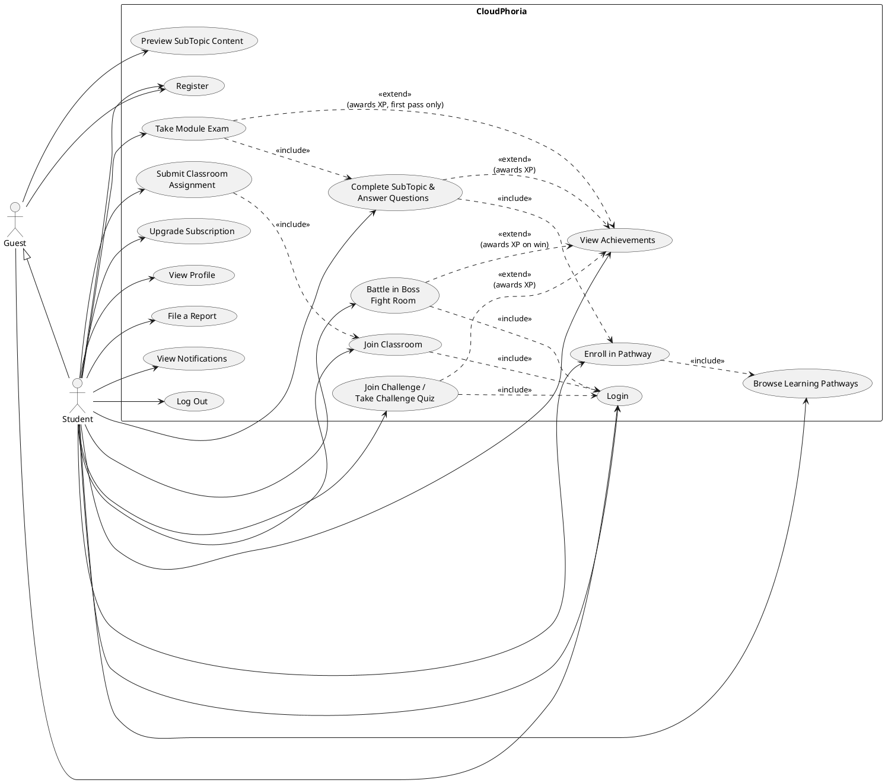
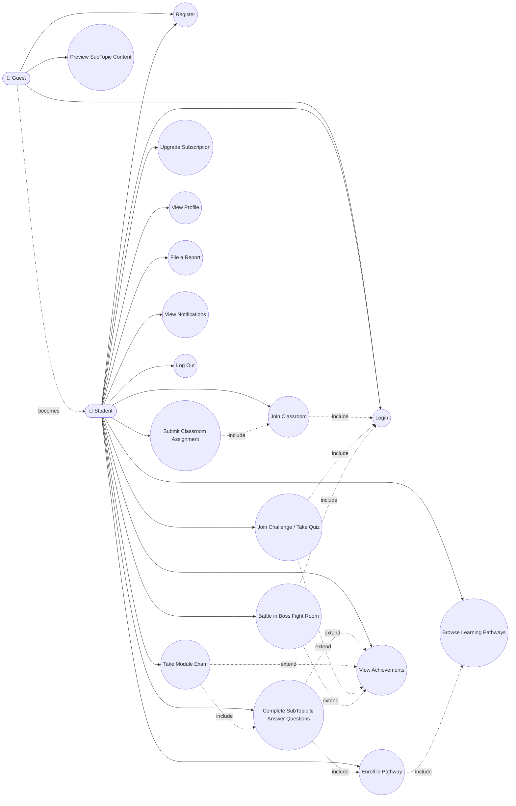

# CloudPhoria — Student Use Case Tables (Corrected)

> Drafting aid only — not referenced by the project, safe to delete anytime, does not affect the build. Written in the same table format as your assignment sample (Use Case / Brief Description / Actors / Precondition / Main Flow / Alternative Flows), based directly on the real code in `Student/*.aspx.cs` and `LogIn.aspx.cs`/`Register.aspx.cs`. Copy each block into your report/Word doc and adjust wording to your own voice.
>
> **This is a corrected revision.** A full audit (see `CloudPhoria_UseCase_Student_Audit.md`) found 7 errors in the original version of this document: two missing use cases, one use case that needed splitting, two use cases with inaccurate descriptions, and two missing relationships. Each correction is marked inline with a short note; the full reasoning and code evidence for each is in the audit file.

---

**Use Case:** Login

**Brief Description:** This use case allows the user to log in to the system.

**Actors:** Student

**Precondition:** User needs to have an existing account in the system.

**Main Flow:**
a) Use case starts when the user opens the login screen
b) User enters an email and password
c) System validates the credentials and grants the user successful access to the Student dashboard.

**Alternative Flows:**
b1) If the email or password is wrong, the system displays "Invalid email or password."
b2) If the account has been banned, the system displays "Your account has been restricted. Please contact the administrator."
b3) If the account is inactive, the system displays "Your account is currently inactive. Please contact the administrator."

---

**Use Case:** Register

**Brief Description:** This use case allows a new user to create a Student account.

**Actors:** Student (Guest before registration)

**Precondition:** User does not already have an account with the same email.

**Main Flow:**
a) Guest opens the Register page
b) Guest fills in full name, email, password, TP number, and selects role "Student"
c) Guest clicks "Register"
d) System creates the account, gives the student the Free subscription plan by default, and automatically logs the student in
e) System redirects the student to the Student Dashboard

**Alternative Flows:**
c1) If any required field is empty, the system displays "Please fill in all required fields."
c2) If the password is under 6 characters, the system displays "Password must be at least 6 characters."
c3) If the email is already registered, the system displays "An account with this email already exists. Please sign in instead."

---

**Use Case:** Browse Learning Pathways

**Brief Description:** This use case allows a student to browse available learning pathways and modules. This is a read-only navigation use case — it does not enroll the student in anything (see "Enroll in Pathway" below for that).

**Actors:** Student

**Precondition:** Student has logged in.

**Main Flow:**
a) Student opens the Pathways tab
b) System displays a list of pathways with their modules
c) Student clicks a pathway to view its modules
d) System displays modules, showing locked/unlocked status based on the student's enrollment state and subscription plan

**Alternative Flows:**
d1) If a module belongs to a pathway that requires a paid subscription the student doesn't have, the system displays an upgrade prompt instead of the module content.

---

**Use Case:** Enroll in Pathway *(CORRECTED — previously missing; was incorrectly folded into "Browse Learning Pathways")*

**Brief Description:** This use case allows a student to formally enroll in a learning pathway, which creates progress tracking for every published module in it. Browsing a pathway and enrolling in it are different actions with different effects, so this is documented as its own use case.

**Actors:** Student

**Precondition:** Student has logged in and is not a Guest. If the pathway is not a Foundation (free) pathway, the student must hold a Pro or Student subscription plan.

**Main Flow:**
a) Student opens a pathway they have not yet enrolled in
b) System displays an "Enroll" button
c) Student clicks "Enroll"
d) System creates a `ModuleProgress` record (`Status='InProgress'`) for every published module in the pathway
e) System redisplays the pathway page, now showing enrolled/in-progress state

**Alternative Flows:**
b1) If the student is on the Free plan and the pathway is not a Foundation pathway, the system shows an upgrade prompt instead of the Enroll button.
b2) If the student has already enrolled, the system shows their progress instead of the Enroll button.

---

**Use Case:** Complete SubTopic and Answer Interactive Questions

**Brief Description:** This use case allows a student to read subtopic content and answer inline interactive questions (MCQ / Regex / String Match).

**Actors:** Student

**Precondition:** Student has logged in, is enrolled in the subtopic's pathway, and the subtopic's module is unlocked for the student.

**Main Flow:**
a) Student opens a SubTopic from a Module
b) System displays the subtopic content and any inline questions
c) Student answers a question and submits
d) System validates the answer server-side and shows immediate correct/incorrect feedback
e) Once all questions are answered, the system marks the subtopic as Completed in `SubTopicProgress` and awards XP

**Alternative Flows:**
c1) If the student re-visits a subtopic already completed, the system shows it as completed without re-awarding XP.
a1) If the student has not enrolled in the subtopic's pathway, the system redirects them to the Pathway Detail page instead of showing the subtopic content.

---

**Use Case:** Take Module Exam

**Brief Description:** This use case allows a student to take a timed final exam for a module and earn XP if they pass.

**Actors:** Student

**Precondition:** Student has logged in, all subtopics in the module are completed, and the student has not already passed this module's exam.

**Main Flow:**
a) Student opens the Exams tab and selects a module
b) System displays the exam intro screen (duration, pass mark, XP reward, question count)
c) Student clicks "Start Exam"
d) System creates an `ExamAttempts` record with a server-side start time and shows one question at a time with a live countdown
e) Student selects an answer and clicks "Submit" for each question
f) System validates and records the answer server-side, then shows the next question
g) On the last question, the system calculates the score, compares it to the pass mark, and shows the result screen
h) If passed for the first time, the system awards XP and updates the student's total XP

**Alternative Flows:**
b1) If the student has already passed this exam, the system displays "You have already passed this module's exam." and does not allow a re-attempt.
b2) If the module's subtopics are not all completed, the system displays "This exam is locked. Complete all subtopics in this module first."
b3) If the module has no exam questions yet, the system displays "This exam has no questions yet. Check back soon."
d1) If the countdown reaches zero before all questions are answered, the system automatically ends the exam, treats unanswered questions as incorrect, and displays "Time ran out — unanswered questions were counted as incorrect."
h1) If the student has already passed this module's exam in an earlier attempt, the system does not award XP again for a repeat pass.

---

**Use Case:** Join Classroom

**Brief Description:** This use case allows a student to join an instructor's classroom using an invite code.

**Actors:** Student

**Precondition:** Student has logged in and has a valid invite code from an instructor.

**Main Flow:**
a) Student opens the Classrooms tab
b) Student enters the invite code and clicks "Join"
c) System looks up the classroom by the invite code
d) System enrols the student and displays "You have successfully joined the classroom!"

**Alternative Flows:**
c1) If the invite code does not match any classroom, the system displays "Invite code not found. Please check and try again."
d1) If the student is already enrolled in that classroom, the system displays "You are already enrolled in this classroom."

---

**Use Case:** Submit Classroom Assignment

**Brief Description:** This use case allows a student to answer and submit a classroom assignment set by their instructor.

**Actors:** Student

**Precondition:** Student has logged in and is enrolled in the classroom that owns the assignment.

**Main Flow:**
a) Student opens an assignment from their classroom
b) System displays the assignment's questions (Objective/MCQ or Subjective/text)
c) Student answers each question
d) Student clicks "Submit"
e) System saves each answer into `AssignmentSubmissions` and displays "You have already submitted this assignment." on reload, showing the student's own submitted answers (read-only)

**Alternative Flows:**
a1) If the assignment has no questions yet, the system displays a "no questions" message instead of an answer form.
a2) If the student is not enrolled in the classroom that owns the assignment, the system displays "You are not enrolled in this classroom." and does not show the assignment.
d1) If the student reloads the page after submitting, the system shows their previously submitted answers instead of a blank form (no duplicate submission is created).

---

**Use Case:** Join Challenge / Take Challenge Quiz

**Brief Description:** This use case allows a student to join a time-boxed challenge and answer its timed quiz questions to earn XP and a leaderboard position.

**Actors:** Student

**Precondition:** Student has logged in and has not already participated in this challenge.

**Main Flow:**
a) Student opens the Challenges tab and selects an active challenge
b) System displays the challenge intro (question count, XP reward, end date)
c) Student clicks "Start Challenge"
d) System shows one question at a time, each with its own time limit
e) Student selects an answer within the time limit
f) On the last question, the system calculates the score, records it in `ChallengeParticipation`, and awards XP
g) System displays the student's rank on the challenge leaderboard

**Alternative Flows:**
c1) If the student has already participated in this challenge, the system does not allow a second attempt and shows their existing score instead.
e1) If the student does not answer before the question's time limit expires, the system treats it as unanswered/incorrect and moves to the next question.

---

**Use Case:** Battle in Boss Fight Room

**Brief Description:** This use case allows a student to play a gamified quiz "battle" against a Boss by answering combat questions correctly to deal damage.

**Actors:** Student

**Precondition:** Student has logged in and the Boss Fight room is published.

**Main Flow:**
a) Student opens Boss Fights and selects a room
b) System starts a `BattleSessions` record and displays the boss and the first question
c) Student answers the question within the time limit
d) System checks the answer; a correct answer damages the boss, an incorrect/timeout answer skips the turn (recorded in `BattleSessionAnswers`)
e) The battle continues until the boss is defeated or the student runs out of questions/health
f) System records the outcome (Won/Lost) and awards XP if the boss was defeated

**Alternative Flows:**
c1) If the student runs out of time on a question, the system records `SelectedOptionID` as NULL (counted as a timeout, not a guess) and continues the battle.

---

**Use Case:** View Achievements *(CORRECTED — description was inaccurate about what the system actually does)*

**Brief Description:** This use case allows a student to view their earned XP history, and any badges/certifications that have been earned. **Correction: badges and certifications are displayed correctly if earned, but no code path in the system currently awards a badge or certification — `UserBadges` and `UserCertifications` are never inserted into anywhere.** Only XP is genuinely awarded automatically (by SubTopic completion, Module Exam passes, Challenges, and Boss Fights). The original version of this use case implied badges/certifications are actively earned through gameplay; that is not yet true in the implementation.

**Actors:** Student

**Precondition:** Student has logged in.

**Main Flow:**
a) Student opens the Achievements page
b) System displays total XP, a list of earned badges (via `UserBadges`), a list of earned certifications (via `UserCertifications`), and the last 20 XP transactions

**Alternative Flows:**
b1) If the student has no badges or certifications yet, the system shows an empty-state message instead of a list (in the current implementation, this will always be the case, since no badge/certification is ever awarded).

---

**Use Case:** Upgrade Subscription

**Brief Description:** This use case allows a student to view subscription plans and upgrade from Free to a paid plan.

**Actors:** Student

**Precondition:** Student has logged in.

**Main Flow:**
a) Student opens the Upgrade/Pricing page
b) System displays available subscription plans and their features
c) Student selects a plan and confirms
d) System updates the student's active subscription

**Alternative Flows:**
c1) If the student already holds the selected plan, the system indicates it is their current plan instead of allowing a duplicate purchase.

---

**Use Case:** View Profile *(CORRECTED — clarified this is read-only; no edit capability exists)*

**Brief Description:** This use case allows a student to view their own account and learning statistics (name, email, TP number, join date, total XP, current plan, modules completed, badge/certification counts). **Correction: there is no profile-editing capability for students — `Student/Profile.aspx.cs` contains no `UPDATE` statement against `Users` or `Students`.** The only interactive control on this page is the report-submission form (see "File a Report" below).

**Actors:** Student

**Precondition:** Student has logged in.

**Main Flow:**
a) Student opens the Profile page
b) System displays the student's account and progress summary, read-only

**Alternative Flows:**
-

---

**Use Case:** File a Report *(CORRECTED — previously missing entirely from this document)*

**Brief Description:** This use case allows a student to submit a report about a content or platform issue for Admin review.

**Actors:** Student

**Precondition:** Student has logged in.

**Main Flow:**
a) Student opens their Profile page and finds the "Report an Issue" section
b) Student selects a content type and writes a reason, clicks "Submit"
c) System inserts a `Reports` row with `Status='Open'` and displays "Report submitted. An admin will review it shortly."

**Alternative Flows:**
b1) If the reason field is empty or invalid, the system does not submit the report (client + server validation).

---

**Use Case:** View Notifications

**Brief Description:** This use case allows a student to view in-app notifications (e.g. classroom announcements, assignment grading, system messages).

**Actors:** Student

**Precondition:** Student has logged in.

**Main Flow:**
a) Student clicks the notification bell or opens the Notifications page
b) System displays the student's notifications, most recent first, and marks them as read

**Alternative Flows:**
-

---

**Use Case:** Log Out

**Brief Description:** This use case allows the student to log out of the system and return to the login screen.

**Actors:** Student

**Precondition:** Student has logged in and is in the dashboard.

**Main Flow:**
a) Student clicks "Log Out" from the top navigation user menu
b) System clears the session
c) System redirects the student to the login screen

**Alternative Flows:**
-

---

**Use Case:** Preview SubTopic Content (Guest) *(CORRECTED — previously missing; Guest's use case set was under-modeled)*

**Brief Description:** This use case allows an unauthenticated Guest to read a subtopic's content and materials, but not answer its questions or mark it complete. This is distinct from "Complete SubTopic and Answer Interactive Questions," which requires login.

**Actors:** Guest

**Precondition:** None (no login required). The subtopic must belong to a published module.

**Main Flow:**
a) Guest opens a SubTopic (typically reached while browsing pathways as a Guest)
b) System displays the subtopic's content and any attached learning materials
c) System shows a "Register to unlock questions" prompt instead of the interactive Questions panel

**Alternative Flows:**
-

---

## Summary of Corrections Made to This Document

| # | Correction | Why |
|---|---|---|
| 1 | Split "Enroll in Pathway" out of "Browse Learning Pathways" | `PathwayDetail.aspx.cs` has a distinct `btnEnroll_Click` handler that changes state (creates `ModuleProgress` rows) — browsing is read-only, enrolling is not. They are different use cases with different triggers and preconditions. |
| 2 | Corrected "View Achievements" description | Verified zero `INSERT INTO UserBadges`/`UserCertifications` anywhere in the codebase, and confirmed 0 rows for both tables in the live database. Only XP is genuinely auto-awarded; badges/certifications are viewable but never actually earned by any current code path. |
| 3 | Corrected "View Profile" description | Verified no `UPDATE` statement against `Users`/`Students` exists in `Student/Profile.aspx.cs` — it is view-only. |
| 4 | Added "File a Report" | Was completely missing, despite `Student/Profile.aspx.cs` having a fully working `btnSubmitReport_Click` handler that inserts into `Reports`. |
| 5 | Added "Preview SubTopic Content" (Guest) | `SubTopicView.aspx.cs` explicitly branches on `isGuest`, showing content/materials but hiding progress tracking and the Questions panel — a real, distinct, limited use case that was previously undocumented. |
| 6 | Added a missing precondition/include note to "Complete SubTopic" | `ModuleDetail.aspx.cs` redirects students who haven't enrolled in the subtopic's pathway back to Pathway Detail — enrollment is an enforced precondition, not just a UI nicety. |
| 7 | Removed "View Leaderboard" as a separate item (kept merged into "Join Challenge") | Confirmed there is no standalone leaderboard page — it only ever appears as the final screen of a challenge attempt, so it was correctly already merged in this document and is called out here for clarity. |

No use case's intended functionality was changed — corrections either split a use case with two genuinely different triggers, added a use case that existed in code but wasn't documented, or fixed a description to match what the code actually does.

---

## Use Case Diagram (Student) — Corrected

### Option A — PlantUML (real UML use-case diagram, ovals + stick figure + include/extend arrows)

Paste this into https://www.plantuml.com/plantuml/uml/ (or the PlantUML VS Code extension) to render a proper UML use-case diagram image:

**What changed from the original diagram:**
- Added `Guest` actor with a UML generalization arrow to `Student` (Guest becomes a Student after registering).
- Added "Enroll in Pathway" as its own use case, included by "Browse Learning Pathways."
- Added "Preview SubTopic Content" for Guest.
- Added "File a Report."
- Corrected the include chain: Take Module Exam now includes Complete SubTopic, which now includes Enroll in Pathway, which includes Browse Learning Pathways — reflecting the real enrollment/completion prerequisite chain in the code, instead of every use case independently including only "Login."
- Corrected the `<<extend>>` relationships to only claim XP is awarded (not "badge/XP" as the original draft said) — badges are not actually awarded by any current code path.

### Option B — Mermaid flowchart approximation (renders on mermaid.live, no PlantUML needed)

Not proper UML notation (no ovals), but quick to render if you just need a visual for a draft/checkpoint:

### How to turn either into an image for your report

1. Copy the PlantUML block (Option A, recommended — it's the real UML notation your brief likely expects) into https://www.plantuml.com/plantuml/uml/
2. Click render, then right-click → Save image (or screenshot) → paste into your Word doc.
3. Alternatively, install the "PlantUML" extension in VS Code and preview it directly, or use draw.io's PlantUML import feature if you want to fine-tune the layout manually afterward.

If you'd like the same table format and diagram for Instructor and Admin roles, just ask.
